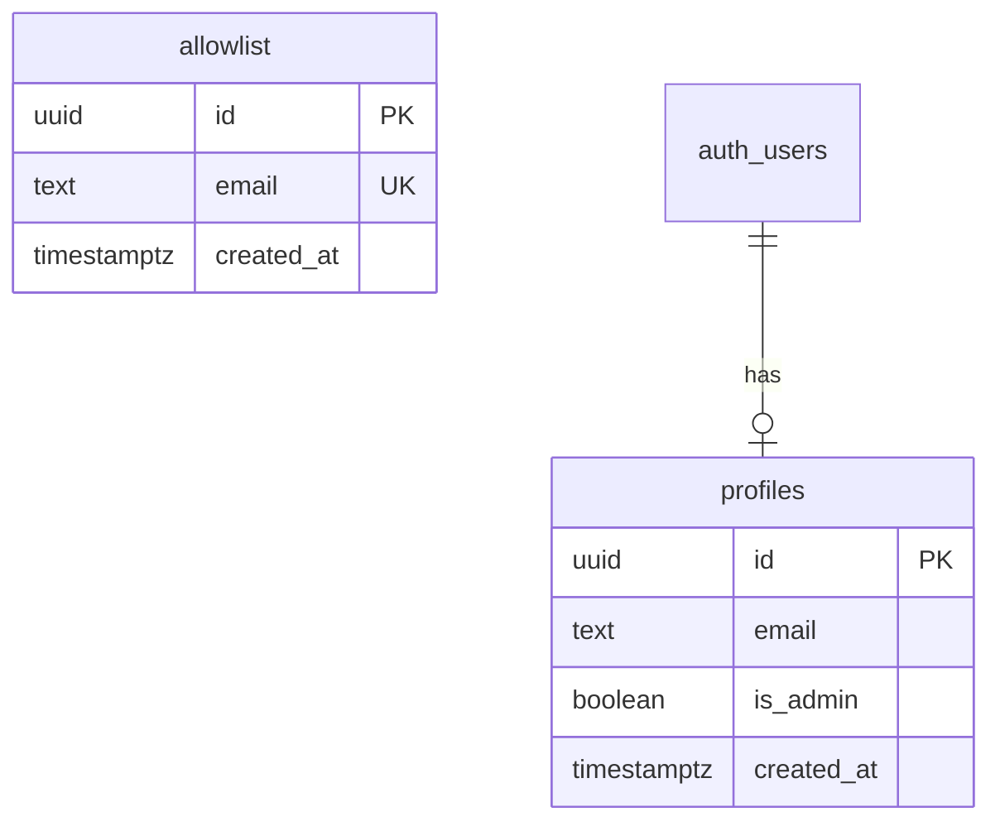

# ✨ Avatarz - AI Avatar Generation App

> A flashy, modern React SPA for generating high-def avatar images with Supabase backend

## Overview

Avatarz is a wizard-based avatar generation app that transforms user photos into stylized avatars using the Gemini API. Users can capture selfies via webcam or upload images, then customize their avatar with style presets, body crop options, and optional name overlays.

**Key Features:**
- Invite-only access via email allowlist
- Magic link authentication (no passwords)
- Webcam capture or image upload
- Multi-step wizard for avatar customization
- AI-powered image transformation via Gemini API
- Multiple download size options
- Admin panel for user management

## Problem Statement / Motivation

Adam needs a personal avatar generation tool that:
1. Restricts access to invited users only
2. Provides a delightful, modern user experience
3. Generates high-quality stylized avatars
4. Is cost-effective (serverless, GitHub Pages hosting)

## Technical Stack

| Layer | Technology |
|-------|------------|
| **Frontend** | React 19 + TypeScript + Vite |
| **Styling** | Tailwind CSS + Framer Motion |
| **UI Components** | shadcn/ui |
| **Backend** | Supabase (Postgres, Auth, Edge Functions) |
| **AI Generation** | Gemini 3 Pro Image API |
| **Hosting** | GitHub Pages |
| **Routing** | React Router with HashRouter |

## Database Schema



### SQL Migrations

```sql
-- Migration: Create allowlist table
CREATE TABLE public.allowlist (
  id UUID PRIMARY KEY DEFAULT gen_random_uuid(),
  email TEXT UNIQUE NOT NULL,
  created_at TIMESTAMPTZ DEFAULT NOW()
);

ALTER TABLE public.allowlist ENABLE ROW LEVEL SECURITY;

-- SECURITY FIX: Use RPC function instead of exposing entire allowlist
-- This function only returns true/false, not the email itself
CREATE OR REPLACE FUNCTION public.check_email_allowlisted(email_to_check TEXT)
RETURNS BOOLEAN AS $$
BEGIN
  RETURN EXISTS (
    SELECT 1 FROM public.allowlist
    WHERE email = LOWER(email_to_check)
  );
END;
$$ LANGUAGE plpgsql SECURITY DEFINER;

-- Grant execute to anon for login check
GRANT EXECUTE ON FUNCTION public.check_email_allowlisted(TEXT) TO anon;

-- Admin can manage allowlist (no anon SELECT policy - use RPC instead)
CREATE POLICY "Admin can manage allowlist"
ON public.allowlist FOR ALL
TO authenticated
USING (
  EXISTS (
    SELECT 1 FROM public.profiles
    WHERE id = auth.uid() AND is_admin = true
  )
);

-- Migration: Create profiles table
CREATE TABLE public.profiles (
  id UUID PRIMARY KEY REFERENCES auth.users(id) ON DELETE CASCADE,
  email TEXT NOT NULL,
  is_admin BOOLEAN DEFAULT false,
  created_at TIMESTAMPTZ DEFAULT NOW()
);

-- Add index for admin lookups
CREATE INDEX idx_profiles_is_admin ON public.profiles(is_admin) WHERE is_admin = true;

ALTER TABLE public.profiles ENABLE ROW LEVEL SECURITY;

-- Users can view their own profile
CREATE POLICY "Users can view own profile"
ON public.profiles FOR SELECT
TO authenticated
USING (auth.uid() = id);

-- Admin can view all profiles
CREATE POLICY "Admin can view all profiles"
ON public.profiles FOR SELECT
TO authenticated
USING (
  EXISTS (
    SELECT 1 FROM public.profiles
    WHERE id = auth.uid() AND is_admin = true
  )
);

-- Config table for admin email (avoid hardcoding)
CREATE TABLE public.config (
  key TEXT PRIMARY KEY,
  value TEXT NOT NULL
);

INSERT INTO public.config (key, value) VALUES ('admin_email', 'ajchesney@gmail.com');

-- Trigger to create profile on signup
CREATE OR REPLACE FUNCTION public.handle_new_user()
RETURNS TRIGGER AS $$
DECLARE
  admin_email TEXT;
BEGIN
  SELECT value INTO admin_email FROM public.config WHERE key = 'admin_email';

  INSERT INTO public.profiles (id, email, is_admin)
  VALUES (
    NEW.id,
    NEW.email,
    NEW.email = admin_email
  );
  RETURN NEW;
END;
$$ LANGUAGE plpgsql SECURITY DEFINER;

CREATE TRIGGER on_auth_user_created
  AFTER INSERT ON auth.users
  FOR EACH ROW EXECUTE FUNCTION public.handle_new_user();

-- Seed admin email in allowlist
INSERT INTO public.allowlist (email) VALUES ('ajchesney@gmail.com');
```

## User Flows

### Flow 1: Non-Allowlisted User
```
Visit App → Enter Email → Check Allowlist → NOT FOUND → "Sorry, you're not on the guest list" message
```

### Flow 2: Allowlisted User Login
```
Visit App → Enter Email → Check Allowlist → FOUND → Send Magic Link → User checks email → Click link → Authenticated → Welcome Screen
```

### Flow 3: Avatar Generation Wizard
```
Welcome Screen → "Create Avatar" button →
  Step 1: Capture/Upload Image → Preview →
  Step 2: Select Style →
  Step 3: Select Body Crop →
  Step 4: Name Overlay (optional) →
  Step 5: Generate (progress indicator) →
  Step 6: Preview Result → Select Size → Download
```

### Flow 4: Admin User Management
```
Login as Admin → Admin Panel link visible → View allowlist → Add email → User can now login
```

## Acceptance Criteria

### Authentication
- [ ] Email input on landing page
- [ ] Check email against allowlist before sending magic link
- [ ] Show "sorry" message for non-allowlisted emails
- [ ] Send magic link for allowlisted emails
- [ ] Magic link redirects to app and authenticates user
- [ ] Session persists across page refreshes
- [ ] Logout functionality

### Admin Panel
- [ ] Only visible to admin user (ajchesney@gmail.com)
- [ ] Display list of allowlisted emails
- [ ] Form to add new email to allowlist
- [ ] Validation for email format
- [ ] Success/error feedback on add

### Image Capture
- [ ] Webcam capture option with live preview
- [ ] Camera permission request handling
- [ ] Fallback message if camera unavailable
- [ ] File upload option (JPG, PNG, WebP)
- [ ] Max file size: 10MB
- [ ] Image preview after capture/upload
- [ ] "Redo" button to retake/reselect

### Style Selection
- [ ] Grid of style options with visual labels
- [ ] Styles: Cartoon, Realistic, Anime, Pixel Art, Watercolor, Oil Painting, Cyberpunk, Vintage, Pop Art, Custom
- [ ] Custom option reveals text input
- [ ] Single selection (radio behavior)

### Body Crop Selection
- [ ] Three options: Headshot, Half Body, Full Body
- [ ] Visual indicators for each option
- [ ] Single selection

### Name Overlay
- [ ] Toggle: "Add name to avatar?" Yes/No
- [ ] If Yes: Text input for name (max 30 chars)
- [ ] Placement options: Graffiti Background, Headband, Necklace, Corner Watermark, Custom
- [ ] Custom reveals text input for placement description

### Generation
- [ ] "Generate" button triggers Edge Function
- [ ] Progress indicator during generation
- [ ] Timeout after 60 seconds with retry option
- [ ] Error handling with user-friendly messages

### Download
- [ ] Preview generated avatar
- [ ] Size options: 512x512, 1024x1024, 2048x2048
- [ ] Download as PNG
- [ ] "Generate Another" button to restart wizard

### UI/UX
- [ ] Flashy, modern design with gradients and animations
- [ ] Smooth transitions between wizard steps
- [ ] Mobile responsive
- [ ] Loading states for all async operations
- [ ] Framer Motion animations throughout

## Technical Implementation

### Phase 1: Project Setup & Infrastructure

#### 1.1 Initialize Vite React Project
```bash
npm create vite@latest . -- --template react-ts
npm install
```

**Dependencies to install:**
```bash
# Core
npm install @supabase/supabase-js react-router-dom

# UI
npm install tailwindcss postcss autoprefixer
npm install framer-motion lucide-react
npm install class-variance-authority clsx tailwind-merge

# Forms & Validation
npm install react-hook-form zod @hookform/resolvers

# Camera
npm install react-webcam

# shadcn/ui setup
npx shadcn@latest init
npx shadcn@latest add button card input form label toast progress
```

#### 1.2 Project Structure
```
src/
├── components/
│   ├── ui/                    # shadcn components
│   ├── auth/
│   │   ├── LoginForm.tsx
│   │   └── AuthGuard.tsx
│   ├── admin/
│   │   ├── AdminGuard.tsx
│   │   └── AllowlistManager.tsx
│   ├── wizard/
│   │   ├── WizardContainer.tsx
│   │   ├── StepIndicator.tsx
│   │   └── steps/
│   │       ├── CaptureStep.tsx
│   │       ├── StyleStep.tsx
│   │       ├── CropStep.tsx
│   │       ├── NameStep.tsx
│   │       ├── GenerateStep.tsx
│   │       └── DownloadStep.tsx
│   └── common/
│       ├── WebcamCapture.tsx
│       ├── ImageUpload.tsx
│       └── ImagePreview.tsx
├── hooks/
│   ├── useAuth.ts
│   ├── useAdmin.ts
│   └── useWizard.ts
├── lib/
│   ├── supabase.ts
│   └── utils.ts
├── types/
│   └── index.ts
├── App.tsx
└── main.tsx
```

#### 1.3 Supabase Configuration

**Environment variables (.env):**
```env
VITE_SUPABASE_URL=https://ucgabgrineaweqpjripj.supabase.co
VITE_SUPABASE_ANON_KEY=your_anon_key_here
```

**src/lib/supabase.ts:**
```typescript
import { createClient } from '@supabase/supabase-js'

export const supabase = createClient(
  import.meta.env.VITE_SUPABASE_URL,
  import.meta.env.VITE_SUPABASE_ANON_KEY
)
```

#### 1.4 Vite Config for GitHub Pages

**vite.config.ts:**
```typescript
import { defineConfig } from 'vite'
import react from '@vitejs/plugin-react'
import path from 'path'

export default defineConfig({
  plugins: [react()],
  resolve: {
    alias: {
      '@': path.resolve(__dirname, './src'),
    },
  },
  base: '/avatarz/',
})
```

**tsconfig.json (add path alias):**
```json
{
  "compilerOptions": {
    "baseUrl": ".",
    "paths": {
      "@/*": ["./src/*"]
    }
  }
}
```

#### 1.5 Type Definitions

**src/types/index.ts:**
```typescript
// Style options for avatar generation
export const STYLES = [
  'cartoon', 'realistic', 'anime', 'pixel-art', 'watercolor',
  'oil-painting', 'cyberpunk', 'vintage', 'pop-art', 'custom'
] as const
export type Style = typeof STYLES[number]

// Body crop options
export const CROP_TYPES = ['headshot', 'half', 'full'] as const
export type CropType = typeof CROP_TYPES[number]

// Name placement options
export const NAME_PLACEMENTS = ['graffiti', 'headband', 'necklace', 'corner', 'custom'] as const
export type NamePlacement = typeof NAME_PLACEMENTS[number]

// Wizard state
export interface WizardState {
  imageData: string | null
  style: Style
  customStyle: string
  cropType: CropType
  showName: boolean
  name: string
  namePlacement: NamePlacement
  customPlacement: string
  generatedImage: string | null
}

// API request/response types
export interface GenerateAvatarRequest {
  imageData: string
  style: Style | string
  customStyle?: string
  cropType: CropType
  name?: string
  namePlacement?: NamePlacement | string
  customPlacement?: string
}

export interface GenerateAvatarResponse {
  success: boolean
  image?: string
  error?: string
}

// Database types
export interface Profile {
  id: string
  email: string
  isAdmin: boolean
  createdAt: string
}

export interface AllowlistEntry {
  id: string
  email: string
  createdAt: string
}
```

#### 1.6 Error Boundary

**src/components/common/ErrorBoundary.tsx:**
```typescript
import { Component, ReactNode } from 'react'
import { Button } from '@/components/ui/button'

interface Props {
  children: ReactNode
  fallback?: ReactNode
}

interface State {
  hasError: boolean
  error: Error | null
}

export class ErrorBoundary extends Component<Props, State> {
  constructor(props: Props) {
    super(props)
    this.state = { hasError: false, error: null }
  }

  static getDerivedStateFromError(error: Error): State {
    return { hasError: true, error }
  }

  componentDidCatch(error: Error, errorInfo: React.ErrorInfo) {
    console.error('Error boundary caught:', error, errorInfo)
  }

  render() {
    if (this.state.hasError) {
      return this.props.fallback || (
        <div className="min-h-screen flex items-center justify-center p-8">
          <div className="text-center max-w-md">
            <h2 className="text-2xl font-bold mb-4">Something went wrong</h2>
            <p className="text-gray-600 mb-6">
              {this.state.error?.message || 'An unexpected error occurred'}
            </p>
            <Button onClick={() => window.location.reload()}>
              Reload Page
            </Button>
          </div>
        </div>
      )
    }

    return this.props.children
  }
}
```

**Usage in App.tsx:**
```typescript
import { ErrorBoundary } from '@/components/common/ErrorBoundary'
import { Toaster } from '@/components/ui/toaster'

export function App() {
  return (
    <ErrorBoundary>
      <HashRouter>
        <Routes>
          {/* routes */}
        </Routes>
      </HashRouter>
      <Toaster />
    </ErrorBoundary>
  )
}
```

### Phase 2: Authentication System

#### 2.1 Login Flow Implementation

**src/components/auth/LoginForm.tsx:**
```typescript
import { useState } from 'react'
import { supabase } from '@/lib/supabase'
import { Button } from '@/components/ui/button'
import { Input } from '@/components/ui/input'
import { motion } from 'framer-motion'
import { Loader2 } from 'lucide-react'
import { useToast } from '@/components/ui/use-toast'

type LoginStatus = 'idle' | 'checking' | 'sending' | 'sent' | 'denied' | 'error'

export function LoginForm() {
  const [email, setEmail] = useState('')
  const [status, setStatus] = useState<LoginStatus>('idle')
  const { toast } = useToast()

  const handleSubmit = async (e: React.FormEvent) => {
    e.preventDefault()
    setStatus('checking')

    try {
      // SECURITY FIX: Use RPC function instead of exposing allowlist
      const { data: isAllowlisted, error: rpcError } = await supabase
        .rpc('check_email_allowlisted', { email_to_check: email.toLowerCase() })

      if (rpcError) {
        console.error('Allowlist check failed:', rpcError)
        toast({
          title: 'Error',
          description: 'Failed to verify email. Please try again.',
          variant: 'destructive',
        })
        setStatus('error')
        return
      }

      if (!isAllowlisted) {
        setStatus('denied')
        return
      }

      setStatus('sending')

      // Send magic link
      const { error: authError } = await supabase.auth.signInWithOtp({
        email: email.toLowerCase(),
        options: {
          emailRedirectTo: `${window.location.origin}/avatarz/#/`,
        },
      })

      if (authError) {
        console.error('Magic link error:', authError)
        toast({
          title: 'Error',
          description: 'Failed to send magic link. Please try again.',
          variant: 'destructive',
        })
        setStatus('error')
        return
      }

      setStatus('sent')
    } catch (err) {
      console.error('Unexpected error:', err)
      toast({
        title: 'Error',
        description: 'Something went wrong. Please try again.',
        variant: 'destructive',
      })
      setStatus('error')
    }
  }

  if (status === 'denied') {
    return (
      <motion.div
        initial={{ opacity: 0, scale: 0.9 }}
        animate={{ opacity: 1, scale: 1 }}
        className="text-center p-8"
      >
        <h2 className="text-2xl font-bold mb-4">Sorry!</h2>
        <p className="text-gray-600">You're not on the guest list.</p>
        <Button onClick={() => setStatus('idle')} className="mt-4">
          Try another email
        </Button>
      </motion.div>
    )
  }

  if (status === 'sent') {
    return (
      <motion.div
        initial={{ opacity: 0, scale: 0.9 }}
        animate={{ opacity: 1, scale: 1 }}
        className="text-center p-8"
      >
        <h2 className="text-2xl font-bold mb-4">Check your email!</h2>
        <p className="text-gray-600">We've sent you a magic link to sign in.</p>
      </motion.div>
    )
  }

  const isLoading = status === 'checking' || status === 'sending'

  return (
    <form onSubmit={handleSubmit} className="space-y-4">
      <Input
        type="email"
        placeholder="Enter your email"
        value={email}
        onChange={(e) => setEmail(e.target.value)}
        disabled={isLoading}
        required
      />
      <Button type="submit" disabled={isLoading} className="w-full">
        {isLoading && <Loader2 className="mr-2 h-4 w-4 animate-spin" />}
        {status === 'checking' ? 'Checking...' : status === 'sending' ? 'Sending...' : 'Get Magic Link'}
      </Button>
      {status === 'error' && (
        <p className="text-sm text-red-500 text-center">
          Something went wrong. <button type="button" onClick={() => setStatus('idle')} className="underline">Try again</button>
        </p>
      )}
    </form>
  )
}
```

#### 2.2 Auth Hook

**src/hooks/useAuth.ts:**
```typescript
import { useEffect, useState } from 'react'
import { User, Session, AuthError } from '@supabase/supabase-js'
import { supabase } from '@/lib/supabase'

interface AuthState {
  user: User | null
  session: Session | null
  loading: boolean
  error: AuthError | null
}

export function useAuth() {
  const [state, setState] = useState<AuthState>({
    user: null,
    session: null,
    loading: true,
    error: null,
  })

  useEffect(() => {
    // FIX: Track mounted state to prevent updates after unmount
    let mounted = true

    const initAuth = async () => {
      try {
        const { data: { session }, error } = await supabase.auth.getSession()

        if (error) throw error
        if (!mounted) return

        setState({
          session,
          user: session?.user ?? null,
          loading: false,
          error: null,
        })
      } catch (err) {
        if (!mounted) return
        setState(prev => ({
          ...prev,
          loading: false,
          error: err instanceof AuthError ? err : null,
        }))
      }
    }

    initAuth()

    const { data: { subscription } } = supabase.auth.onAuthStateChange(
      (_event, session) => {
        if (!mounted) return
        setState(prev => ({
          ...prev,
          session,
          user: session?.user ?? null,
        }))
      }
    )

    return () => {
      mounted = false
      subscription.unsubscribe()
    }
  }, [])

  const signOut = async () => {
    const { error } = await supabase.auth.signOut()
    if (error) throw error
  }

  return {
    user: state.user,
    session: state.session,
    loading: state.loading,
    error: state.error,
    signOut,
  }
}
```

### Phase 3: Admin Panel

#### 3.1 Admin Guard

**src/hooks/useAdmin.ts:**
```typescript
import { useEffect, useState } from 'react'
import { supabase } from '@/lib/supabase'
import { useAuth } from './useAuth'

export function useAdmin() {
  const { user } = useAuth()
  const [isAdmin, setIsAdmin] = useState(false)
  const [loading, setLoading] = useState(true)

  useEffect(() => {
    async function checkAdmin() {
      if (!user) {
        setIsAdmin(false)
        setLoading(false)
        return
      }

      const { data } = await supabase
        .from('profiles')
        .select('is_admin')
        .eq('id', user.id)
        .single()

      setIsAdmin(data?.is_admin ?? false)
      setLoading(false)
    }

    checkAdmin()
  }, [user])

  return { isAdmin, loading }
}
```

#### 3.2 Allowlist Manager

**src/components/admin/AllowlistManager.tsx:**
```typescript
import { useState, useEffect } from 'react'
import { supabase } from '@/lib/supabase'
import { Button } from '@/components/ui/button'
import { Input } from '@/components/ui/input'

export function AllowlistManager() {
  const [emails, setEmails] = useState<string[]>([])
  const [newEmail, setNewEmail] = useState('')
  const [loading, setLoading] = useState(true)

  useEffect(() => {
    fetchEmails()
  }, [])

  const fetchEmails = async () => {
    const { data } = await supabase
      .from('allowlist')
      .select('email')
      .order('created_at', { ascending: false })

    setEmails(data?.map((d) => d.email) ?? [])
    setLoading(false)
  }

  const addEmail = async (e: React.FormEvent) => {
    e.preventDefault()
    if (!newEmail) return

    const { error } = await supabase
      .from('allowlist')
      .insert({ email: newEmail.toLowerCase() })

    if (!error) {
      setEmails([newEmail.toLowerCase(), ...emails])
      setNewEmail('')
    }
  }

  return (
    <div className="space-y-6">
      <form onSubmit={addEmail} className="flex gap-2">
        <Input
          type="email"
          placeholder="Email to add"
          value={newEmail}
          onChange={(e) => setNewEmail(e.target.value)}
        />
        <Button type="submit">Add</Button>
      </form>

      <div className="space-y-2">
        <h3 className="font-semibold">Allowlisted Emails</h3>
        {loading ? (
          <p>Loading...</p>
        ) : (
          <ul className="space-y-1">
            {emails.map((email) => (
              <li key={email} className="text-sm text-gray-600">
                {email}
              </li>
            ))}
          </ul>
        )}
      </div>
    </div>
  )
}
```

### Phase 4: Avatar Wizard

#### 4.1 Wizard State Management

**src/hooks/useWizard.ts:**
```typescript
import { useState } from 'react'

export interface WizardState {
  imageData: string | null
  style: string
  customStyle: string
  cropType: 'headshot' | 'half' | 'full'
  showName: boolean
  name: string
  namePlacement: string
  customPlacement: string
  generatedImage: string | null
}

const initialState: WizardState = {
  imageData: null,
  style: 'cartoon',
  customStyle: '',
  cropType: 'headshot',
  showName: false,
  name: '',
  namePlacement: 'graffiti',
  customPlacement: '',
  generatedImage: null,
}

export function useWizard() {
  const [step, setStep] = useState(0)
  const [state, setState] = useState<WizardState>(initialState)

  const nextStep = () => setStep((s) => Math.min(s + 1, 5))
  const prevStep = () => setStep((s) => Math.max(s - 1, 0))
  const goToStep = (s: number) => setStep(s)

  const updateState = (updates: Partial<WizardState>) => {
    setState((prev) => ({ ...prev, ...updates }))
  }

  const reset = () => {
    setStep(0)
    setState(initialState)
  }

  return {
    step,
    state,
    nextStep,
    prevStep,
    goToStep,
    updateState,
    reset,
  }
}
```

#### 4.2 Wizard Container

**src/components/wizard/WizardContainer.tsx:**
```typescript
import { motion, AnimatePresence } from 'framer-motion'
import { useWizard } from '@/hooks/useWizard'
import { StepIndicator } from './StepIndicator'
import { CaptureStep } from './steps/CaptureStep'
import { StyleStep } from './steps/StyleStep'
import { CropStep } from './steps/CropStep'
import { NameStep } from './steps/NameStep'
import { GenerateStep } from './steps/GenerateStep'
import { DownloadStep } from './steps/DownloadStep'

const steps = ['Capture', 'Style', 'Crop', 'Name', 'Generate', 'Download']

export function WizardContainer() {
  const wizard = useWizard()

  const renderStep = () => {
    switch (wizard.step) {
      case 0:
        return <CaptureStep wizard={wizard} />
      case 1:
        return <StyleStep wizard={wizard} />
      case 2:
        return <CropStep wizard={wizard} />
      case 3:
        return <NameStep wizard={wizard} />
      case 4:
        return <GenerateStep wizard={wizard} />
      case 5:
        return <DownloadStep wizard={wizard} />
      default:
        return null
    }
  }

  return (
    <div className="max-w-2xl mx-auto p-6">
      <StepIndicator steps={steps} currentStep={wizard.step} />

      <AnimatePresence mode="wait">
        <motion.div
          key={wizard.step}
          initial={{ opacity: 0, x: 50 }}
          animate={{ opacity: 1, x: 0 }}
          exit={{ opacity: 0, x: -50 }}
          transition={{ duration: 0.3 }}
          className="mt-8"
        >
          {renderStep()}
        </motion.div>
      </AnimatePresence>
    </div>
  )
}
```

### Phase 5: Edge Function for Gemini API

#### 5.1 Create Edge Function

```bash
supabase functions new generate-avatar
```

**supabase/functions/generate-avatar/index.ts:**
```typescript
import { serve } from 'https://deno.land/std@0.168.0/http/server.ts'
import { createClient } from 'https://esm.sh/@supabase/supabase-js@2'

const corsHeaders = {
  'Access-Control-Allow-Origin': '*',
  'Access-Control-Allow-Headers': 'authorization, x-client-info, apikey, content-type',
}

// SECURITY: Define allowed values to prevent prompt injection
const ALLOWED_STYLES = new Set([
  'cartoon', 'realistic', 'anime', 'pixel-art', 'watercolor',
  'oil-painting', 'cyberpunk', 'vintage', 'pop-art'
])
const ALLOWED_CROP_TYPES = new Set(['headshot', 'half', 'full'])
const ALLOWED_NAME_PLACEMENTS = new Set(['graffiti', 'headband', 'necklace', 'corner'])

// Type definitions
interface GenerateAvatarRequest {
  imageData: string
  style: string
  cropType: string
  name?: string
  namePlacement?: string
  customStyle?: string
  customPlacement?: string
}

interface GeminiResponse {
  candidates?: Array<{
    content?: {
      parts?: Array<{
        inline_data?: {
          mime_type?: string
          data?: string
        }
      }>
    }
  }>
}

// SECURITY: Validate and sanitize all inputs
function validateRequest(payload: unknown): GenerateAvatarRequest {
  if (!payload || typeof payload !== 'object') {
    throw new Error('Invalid request payload')
  }

  const req = payload as GenerateAvatarRequest

  // Validate imageData
  if (!req.imageData || typeof req.imageData !== 'string') {
    throw new Error('Missing or invalid imageData')
  }

  if (!req.imageData.startsWith('data:image/')) {
    throw new Error('Invalid image format')
  }

  // Check size (10MB limit)
  const base64Data = req.imageData.split(',')[1] || ''
  const sizeInBytes = (base64Data.length * 3) / 4
  if (sizeInBytes > 10 * 1024 * 1024) {
    throw new Error('Image exceeds 10MB limit')
  }

  // Validate style
  if (!req.style || typeof req.style !== 'string') {
    throw new Error('Missing or invalid style')
  }

  // Allow custom style OR preset style
  if (!req.customStyle && !ALLOWED_STYLES.has(req.style)) {
    throw new Error('Invalid style option')
  }

  // Sanitize custom style (max 100 chars, alphanumeric + spaces only)
  if (req.customStyle) {
    if (typeof req.customStyle !== 'string' || req.customStyle.length > 100) {
      throw new Error('Custom style must be under 100 characters')
    }
    if (!/^[a-zA-Z0-9\s\-]+$/.test(req.customStyle)) {
      throw new Error('Custom style contains invalid characters')
    }
  }

  // Validate cropType
  if (!req.cropType || !ALLOWED_CROP_TYPES.has(req.cropType)) {
    throw new Error('Invalid crop type')
  }

  // Validate name if provided (max 30 chars, alphanumeric + spaces)
  if (req.name) {
    if (typeof req.name !== 'string' || req.name.length > 30) {
      throw new Error('Name must be under 30 characters')
    }
    if (!/^[a-zA-Z0-9\s]+$/.test(req.name)) {
      throw new Error('Name contains invalid characters')
    }
  }

  // Validate namePlacement if name provided
  if (req.name && req.namePlacement) {
    if (!req.customPlacement && !ALLOWED_NAME_PLACEMENTS.has(req.namePlacement)) {
      throw new Error('Invalid name placement')
    }
    // Sanitize custom placement
    if (req.customPlacement) {
      if (typeof req.customPlacement !== 'string' || req.customPlacement.length > 100) {
        throw new Error('Custom placement must be under 100 characters')
      }
      if (!/^[a-zA-Z0-9\s\-]+$/.test(req.customPlacement)) {
        throw new Error('Custom placement contains invalid characters')
      }
    }
  }

  return req
}

serve(async (req) => {
  if (req.method === 'OPTIONS') {
    return new Response('ok', { headers: corsHeaders })
  }

  try {
    // Verify authentication
    const authHeader = req.headers.get('Authorization')
    if (!authHeader) {
      return new Response(JSON.stringify({ error: 'Missing authorization' }), {
        status: 401,
        headers: { ...corsHeaders, 'Content-Type': 'application/json' },
      })
    }

    const supabase = createClient(
      Deno.env.get('SUPABASE_URL') ?? '',
      Deno.env.get('SUPABASE_ANON_KEY') ?? '',
      { global: { headers: { Authorization: authHeader } } }
    )

    const { data: { user } } = await supabase.auth.getUser()
    if (!user) {
      return new Response(JSON.stringify({ error: 'Unauthorized' }), {
        status: 401,
        headers: { ...corsHeaders, 'Content-Type': 'application/json' },
      })
    }

    // Parse and validate request
    const payload = await req.json()
    const validatedReq = validateRequest(payload)

    // Build prompt with sanitized inputs
    const style = validatedReq.customStyle?.trim() || validatedReq.style
    let prompt = `Transform this photo into a ${style} style avatar.`

    const cropDescriptions: Record<string, string> = {
      headshot: 'only the head and shoulders',
      half: 'from the waist up',
      full: 'the full body'
    }
    prompt += ` Show ${cropDescriptions[validatedReq.cropType]}.`

    if (validatedReq.name && validatedReq.namePlacement) {
      const placement = validatedReq.customPlacement?.trim() || validatedReq.namePlacement
      const placementDescriptions: Record<string, string> = {
        graffiti: 'as graffiti in the background',
        headband: 'on a headband',
        necklace: 'on a necklace',
        corner: 'as a watermark in the corner'
      }
      const placementDesc = placementDescriptions[placement] || `${placement}`
      prompt += ` Include the name "${validatedReq.name}" ${placementDesc}.`
    }

    prompt += ' Make it high quality and visually striking. Ensure appropriate content only.'

    // Call Gemini API
    const GEMINI_API_KEY = Deno.env.get('GEMINI_API_KEY')

    const geminiResponse = await fetch(
      `https://generativelanguage.googleapis.com/v1beta/models/gemini-3-pro:generateContent?key=${GEMINI_API_KEY}`,
      {
        method: 'POST',
        headers: { 'Content-Type': 'application/json' },
        body: JSON.stringify({
          contents: [{
            parts: [
              { text: prompt },
              {
                inline_data: {
                  mime_type: 'image/jpeg',
                  data: validatedReq.imageData.replace(/^data:image\/\w+;base64,/, ''),
                },
              },
            ],
          }],
          generationConfig: {
            responseModalities: ['image', 'text'],
            responseMimeType: 'image/png',
          },
        }),
      }
    )

    if (!geminiResponse.ok) {
      const errorText = await geminiResponse.text()
      console.error('Gemini API error:', errorText)
      throw new Error('Failed to generate avatar')
    }

    const result: GeminiResponse = await geminiResponse.json()

    // Type-safe image extraction
    const generatedImageData = result.candidates?.[0]?.content?.parts?.find(
      (part): part is { inline_data: { mime_type: string; data: string } } =>
        part.inline_data?.mime_type?.startsWith('image/') ?? false
    )?.inline_data?.data

    if (!generatedImageData || typeof generatedImageData !== 'string') {
      throw new Error('No image generated')
    }

    return new Response(
      JSON.stringify({
        success: true,
        image: `data:image/png;base64,${generatedImageData}`,
      }),
      { headers: { ...corsHeaders, 'Content-Type': 'application/json' } }
    )

  } catch (error) {
    console.error('Error:', error)
    const message = error instanceof Error ? error.message : 'Generation failed'
    return new Response(
      JSON.stringify({ error: message }),
      { status: 500, headers: { ...corsHeaders, 'Content-Type': 'application/json' } }
    )
  }
})
```

#### 5.2 Deploy Edge Function

```bash
# Set Gemini API key
supabase secrets set GEMINI_API_KEY=your_gemini_api_key

# Deploy function
supabase functions deploy generate-avatar
```

### Phase 6: Deployment

#### 6.1 GitHub Actions Workflow

**.github/workflows/deploy.yml:**
```yaml
name: Deploy to GitHub Pages

on:
  push:
    branches: ['main']
  workflow_dispatch:

permissions:
  contents: read
  pages: write
  id-token: write

jobs:
  build:
    runs-on: ubuntu-latest
    steps:
      - name: Checkout
        uses: actions/checkout@v4

      - name: Setup Node
        uses: actions/setup-node@v4
        with:
          node-version: 20
          cache: 'npm'

      - name: Install dependencies
        run: npm ci

      - name: Build
        run: npm run build
        env:
          VITE_SUPABASE_URL: ${{ secrets.VITE_SUPABASE_URL }}
          VITE_SUPABASE_ANON_KEY: ${{ secrets.VITE_SUPABASE_ANON_KEY }}

      - name: Setup Pages
        uses: actions/configure-pages@v4

      - name: Upload artifact
        uses: actions/upload-pages-artifact@v3
        with:
          path: './dist'

  deploy:
    environment:
      name: github-pages
      url: ${{ steps.deployment.outputs.page_url }}
    runs-on: ubuntu-latest
    needs: build
    steps:
      - name: Deploy to GitHub Pages
        id: deployment
        uses: actions/deploy-pages@v4
```

#### 6.2 Configure GitHub Secrets

Add these secrets in GitHub repo settings:
- `VITE_SUPABASE_URL`
- `VITE_SUPABASE_ANON_KEY`

## Implementation Phases

### Phase 1: Foundation (Day 1-2)
- [ ] Initialize Vite React TypeScript project
- [ ] Install and configure Tailwind CSS
- [ ] Set up shadcn/ui components
- [ ] Configure Supabase client
- [ ] Set up React Router with HashRouter
- [ ] Create basic layout and navigation

### Phase 2: Database & Auth (Day 2-3)
- [ ] Run database migrations (allowlist, profiles)
- [ ] Implement login form with email check
- [ ] Implement magic link authentication
- [ ] Create auth hook and context
- [ ] Implement logout functionality
- [ ] Test authentication flow end-to-end

### Phase 3: Admin Panel (Day 3)
- [ ] Create admin guard/check
- [ ] Build allowlist manager component
- [ ] Add admin navigation link (conditional)
- [ ] Test adding users to allowlist

### Phase 4: Wizard UI (Day 4-5)
- [ ] Create wizard container with step management
- [ ] Build step indicator component
- [ ] Implement CaptureStep (webcam + upload)
- [ ] Implement StyleStep (style selection grid)
- [ ] Implement CropStep (body crop selection)
- [ ] Implement NameStep (name overlay options)
- [ ] Add Framer Motion animations
- [ ] Test wizard navigation

### Phase 5: Generation & Download (Day 5-6)
- [ ] Create and deploy Edge Function
- [ ] Store Gemini API key in Supabase secrets
- [ ] Implement GenerateStep with progress indicator
- [ ] Implement DownloadStep with size options
- [ ] Add error handling and retry logic
- [ ] Test full generation flow

### Phase 6: Polish & Deploy (Day 6-7)
- [ ] Add flashy design elements (gradients, animations)
- [ ] Ensure mobile responsiveness
- [ ] Add loading states throughout
- [ ] Set up GitHub Actions workflow
- [ ] Configure GitHub secrets
- [ ] Deploy to GitHub Pages
- [ ] Test production deployment

## Success Metrics

1. **Functional**: All wizard steps work end-to-end
2. **Secure**: Only allowlisted users can access
3. **Performant**: Generation completes in < 60 seconds
4. **Usable**: Mobile and desktop friendly
5. **Deployed**: Accessible via GitHub Pages URL

## Dependencies & Risks

| Risk | Mitigation |
|------|------------|
| Gemini API rate limits | Implement client-side cooldown |
| Gemini API failures | Retry logic + user-friendly errors |
| Camera permissions denied | Fallback to upload-only |
| Large image uploads | Client-side resize before upload |
| GitHub Pages routing | HashRouter handles SPA routing |

## References

### Internal
- Supabase project: `ucgabgrineaweqpjripj`
- Repository: `TiGz/avatarz`

### External
- [Supabase Auth Docs](https://supabase.com/docs/guides/auth)
- [Supabase Edge Functions](https://supabase.com/docs/guides/functions)
- [Gemini API Image Generation](https://ai.google.dev/gemini-api/docs/image-generation)
- [Vite Deployment Guide](https://vite.dev/guide/static-deploy)
- [Framer Motion](https://www.framer.com/motion/)
- [shadcn/ui](https://ui.shadcn.com/)
- [react-webcam](https://www.npmjs.com/package/react-webcam)

---

🤖 Generated with [Claude Code](https://claude.com/claude-code)
