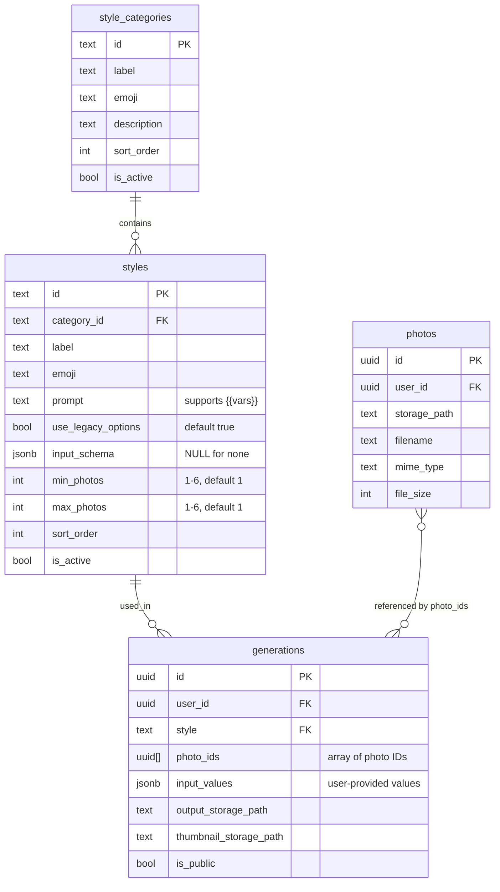

# feat: Dynamic Wizard with Multi-Photo and Parameterized Styles

## Overview

Refactor the Avatarz wizard to support dynamic multi-photo inputs and parameterized styles. This enables group photos from 2-6 input images and styles with configurable user inputs (text fields).

**Current Flow:**
```
Capture Photo → Category → Style → Crop → Name → Generate → Download
```

**Proposed Flow:**
```
Category → Style → Capture Photo(s) → Options → Generate → Download
```

**Key Changes:**
1. **Photo selection after Style** - Style defines `min_photos` / `max_photos` (1-6 range)
2. **Style-driven UI** - Style determines photo requirements and what options to show
3. **No type selection step** - Users browse all categories/styles normally. Special styles just show their requirements.

## Problem Statement / Motivation

The current system only supports single-photo avatar generation with hardcoded options (crop, age, background, name). Users want:

1. **Group photos**: Generate images with 2-6 people from separate photos (e.g., wedding couples, friend groups, family portraits)
2. **Parameterized styles**: Styles that require specific inputs (e.g., "Movie Name" + "Character" for a movie poster style)
3. **Flexible configuration**: Different styles have different customization needs, currently all use the same fixed options

## Proposed Solution

### Style-Driven Approach (No Type Selection)

Instead of asking users to choose a "type", styles declare what they need:

| Style Property | Purpose |
|----------------|---------|
| `min_photos` / `max_photos` | How many photos this style accepts (1-6) |
| `input_schema` | Dynamic form fields (text inputs, dropdowns) - NULL for standard styles |

**Standard styles** (existing): `min_photos=1, max_photos=1, input_schema=NULL` → Show legacy options (crop, age, background, name)

**Special styles** (new): Custom photo counts and/or `input_schema` → Show dynamic form based on schema

**Example Special Styles:**
- **Snowglobe Couple**: `min_photos=2, max_photos=2` - Creates snowglobe with 2 figurines
- **Group Photo**: `min_photos=2, max_photos=6` - Creates group composition
- **Movie Poster**: `min_photos=1, max_photos=1, input_schema={movie_name, character}` - Single photo + custom inputs

### Database Schema Changes

```sql
-- Add photo requirements, dynamic schema, and legacy options flag to styles
ALTER TABLE styles
ADD COLUMN input_schema JSONB,
ADD COLUMN min_photos INTEGER NOT NULL DEFAULT 1 CHECK (min_photos >= 1 AND min_photos <= 6),
ADD COLUMN max_photos INTEGER NOT NULL DEFAULT 1 CHECK (max_photos >= 1 AND max_photos <= 6),
ADD COLUMN use_legacy_options BOOLEAN NOT NULL DEFAULT true;

ALTER TABLE styles ADD CONSTRAINT photos_range CHECK (min_photos <= max_photos);

-- Store photo IDs as array and input values on generations
ALTER TABLE generations
ADD COLUMN photo_ids UUID[],
ADD COLUMN input_values JSONB;
```

**Column meanings:**
| Column | Default | Purpose |
|--------|---------|---------|
| `use_legacy_options` | `true` | Show crop/age/background/name options. Set `false` for styles with self-contained prompts. |
| `input_schema` | `NULL` | Dynamic form fields. If non-NULL, these replace legacy options. |
| `min_photos` / `max_photos` | `1` / `1` | How many photos the style accepts. |

**Options step logic:**
- `use_legacy_options = true` AND `input_schema IS NULL` → Show legacy options (crop, age, etc.)
- `use_legacy_options = false` AND `input_schema IS NULL` → Skip options step entirely
- `input_schema IS NOT NULL` → Show dynamic form (ignores `use_legacy_options`)

**Simplified from reviewer feedback:**
- No `type` column anywhere - style behavior determined by columns above
- No junction table - `UUID[]` array is simpler for 1-6 photos
- No `prompt_template` - use simple `{{var}}` replacement on existing `prompt` column

### Input Schema Structure

Simple text-only inputs (add more field types later if needed):

```typescript
interface InputSchema {
  fields: InputField[]
}

interface InputField {
  id: string           // Maps to template variable {{id}}
  label: string        // Display label
  required: boolean    // Blocks generation if empty
  placeholder?: string // Placeholder text
}
```

**Example Schema:**
```json
{
  "fields": [
    {
      "id": "movie_name",
      "label": "Movie Name",
      "required": true,
      "placeholder": "Enter movie title..."
    },
    {
      "id": "character_role",
      "label": "Character Role",
      "required": true,
      "placeholder": "Hero, Villain, etc."
    }
  ]
}
```

### Prompt Variable Substitution

Use simple `{{variable}}` replacement in the existing `prompt` column:

```
Transform into a movie poster for "{{movie_name}}".
The person should appear as the {{character_role}} character.
```

**Simple replacement in Edge Function:**
```typescript
const renderPrompt = (prompt: string, values: Record<string, string>) =>
  prompt.replace(/\{\{(\w+)\}\}/g, (_, key) => values[key] || '')
```

No complex template engine. No conditionals. If a style needs conditional logic, write different styles.

## Technical Approach

### Phase 1: Database Migration & Backend

#### 1.1 Migration Files

**[supabase/migrations/YYYYMMDD_add_multi_photo_support.sql](supabase/migrations/)**
```sql
-- Add photo requirements and dynamic schema to styles
ALTER TABLE styles
ADD COLUMN input_schema JSONB,
ADD COLUMN min_photos INTEGER NOT NULL DEFAULT 1 CHECK (min_photos >= 1 AND min_photos <= 6),
ADD COLUMN max_photos INTEGER NOT NULL DEFAULT 1 CHECK (max_photos >= 1 AND max_photos <= 6);

ALTER TABLE styles ADD CONSTRAINT photos_range CHECK (min_photos <= max_photos);

-- Store photo IDs as array and input values on generations
ALTER TABLE generations
ADD COLUMN photo_ids UUID[],
ADD COLUMN input_values JSONB;
```

**That's it.** No type columns, no junction tables, no prompt_template column.

#### 1.2 Edge Function Updates

**[supabase/functions/generate-avatar/index.ts](supabase/functions/generate-avatar/index.ts)**

Update GET endpoint to return new fields:
```typescript
// Categories unchanged
categories: rows.map(c => ({
  id: c.id,
  label: c.label,
  emoji: c.emoji,
  description: c.description,
}))

// Styles now include photo requirements and schema
styles: rows.map(s => ({
  id: s.id,
  categoryId: s.category_id,
  label: s.label,
  emoji: s.emoji,
  useLegacyOptions: s.use_legacy_options,  // NEW: show crop/age/etc options
  inputSchema: s.input_schema,              // NEW: dynamic form fields (null for none)
  minPhotos: s.min_photos,                  // NEW: 1-6
  maxPhotos: s.max_photos,                  // NEW: 1-6
}))
```

Update POST endpoint:
```typescript
interface GenerateRequest {
  // Photo input
  photoIds: string[]             // Array of photo IDs (1-6)

  style: string
  customStyle?: string

  // Dynamic inputs (for styles with input_schema)
  inputValues?: Record<string, string>

  // Legacy fields (for styles without input_schema)
  cropType?: string
  name?: string
  namePlacement?: string
  keepBackground?: boolean
  ageModification?: 'normal' | 'younger' | 'older'
  customisationText?: string

  isPublic: boolean
}
```

Simple prompt rendering (5 lines, not 20):
```typescript
const renderPrompt = (prompt: string, values: Record<string, string>) =>
  prompt.replace(/\{\{(\w+)\}\}/g, (_, key) => values[key] || '')
```

### Phase 2: Frontend Types & Hooks

#### 2.1 Type Definitions

**[src/types/index.ts](src/types/index.ts)**
```typescript
// Start with text-only inputs (add dropdown later if needed)
export interface InputField {
  id: string
  label: string
  required: boolean
  placeholder?: string
}

export interface InputSchema {
  fields: InputField[]
}

// CategoryOption unchanged
export interface CategoryOption {
  id: string
  label: string
  emoji: string
  description: string
}

// StyleOption adds photo requirements and schema
export interface StyleOption {
  id: string
  categoryId: string
  label: string
  emoji: string
  useLegacyOptions: boolean        // NEW: true = show crop/age/background/name
  inputSchema: InputSchema | null  // NEW: null = no dynamic inputs
  minPhotos: number                // NEW: 1-6
  maxPhotos: number                // NEW: 1-6
}

// Updated WizardState
export interface WizardState {
  // Selection
  category: string
  style: string
  customStyle: string

  // Photos - now supports multi-select
  selectedPhotoIds: string[]         // NEW: replaces imageData for library photos

  // Dynamic inputs (for styles with input_schema)
  inputValues: Record<string, string>   // NEW

  // Legacy options (still used for Avatar type styles without schema)
  cropType: string
  showName: boolean
  name: string
  namePlacement: string
  customPlacement: string
  keepBackground: boolean
  ageModification: 'normal' | 'younger' | 'older'
  customTextEnabled: boolean
  customText: string

  // Generation state
  generatedImage: string | null
  isPublic: boolean
  shareUrl: string | null
}
```

#### 2.2 Wizard Hook Updates

**[src/hooks/useWizard.ts](src/hooks/useWizard.ts)**
```typescript
// Step enumeration - photos after style selection
export const WIZARD_STEPS = {
  CATEGORY: 0,
  STYLE: 1,
  CAPTURE: 2,     // Photos after style (style defines how many)
  OPTIONS: 3,     // Dynamic inputs OR legacy options based on style.inputSchema
  GENERATE: 4,
  DOWNLOAD: 5
}

// State clearing rules
const clearOnCategoryChange = (state: WizardState): Partial<WizardState> => ({
  style: '',
  inputValues: {},
  selectedPhotoIds: [],
})

const clearOnStyleChange = (state: WizardState): Partial<WizardState> => ({
  inputValues: {},
  selectedPhotoIds: [],
})
```

### Phase 3: Frontend Components

#### 3.1 New Components

**[src/components/wizard/steps/DynamicInputsStep.tsx](src/components/wizard/steps/DynamicInputsStep.tsx)** (NEW)

Simple text inputs only (add more field types later if needed):
```typescript
interface DynamicInputsStepProps {
  wizard: WizardHook
  schema: InputSchema
}

export function DynamicInputsStep({ wizard, schema }: DynamicInputsStepProps) {
  return (
    <div className="space-y-4">
      {schema.fields.map(field => (
        <div key={field.id}>
          <Label>
            {field.label}
            {field.required && <span className="text-red-500">*</span>}
          </Label>
          <Input
            value={wizard.state.inputValues[field.id] || ''}
            onChange={(e) => wizard.setInputValue(field.id, e.target.value)}
            placeholder={field.placeholder}
          />
        </div>
      ))}
    </div>
  )
}
```

#### 3.2 Updated Components

**[src/components/wizard/steps/CaptureStep.tsx](src/components/wizard/steps/CaptureStep.tsx)**

Now comes AFTER style selection. Knows exactly how many photos are needed:
```typescript
interface CaptureStepProps {
  wizard: WizardHook
  minPhotos: number  // From selected style
  maxPhotos: number  // From selected style
}

export function CaptureStep({ wizard, minPhotos, maxPhotos }: CaptureStepProps) {
  const photoCount = wizard.state.selectedPhotoIds.length + (wizard.state.imageData ? 1 : 0)
  const canProceed = photoCount >= minPhotos && photoCount <= maxPhotos

  // Special case: style needs 0 photos (e.g., "Name Art")
  if (maxPhotos === 0) {
    return <div>This style doesn't require any photos. Click Continue.</div>
  }

  return (
    <div>
      {/* Photo count indicator */}
      <div className="text-sm text-gray-500">
        {photoCount} / {minPhotos === maxPhotos ? minPhotos : `${minPhotos}-${maxPhotos}`} photos
      </div>

      {/* Camera capture (adds to collection) */}
      <CameraCapture onCapture={handleCapture} />

      {/* File upload (adds to collection) */}
      <FileUpload onUpload={handleUpload} />

      {/* Photo library with multi-select */}
      <PhotoGrid
        photos={userPhotos}
        selected={wizard.state.selectedPhotoIds}
        onToggle={handlePhotoToggle}
        maxSelection={maxPhotos}
      />

      {/* Selected photos preview with reorder/remove */}
      <SelectedPhotosPreview
        photos={selectedPhotos}
        onReorder={handleReorder}
        onRemove={handleRemove}
      />

      <Button disabled={!canProceed} onClick={wizard.nextStep}>
        Continue
      </Button>
    </div>
  )
}
```

**[src/components/wizard/steps/CategoryStep.tsx](src/components/wizard/steps/CategoryStep.tsx)**

Now step 0 (first step). Shows all categories:
```typescript
// Show all active categories
const categories = options?.categories

// Standard category selection UI - unchanged from current
return (
  <div className="grid grid-cols-2 gap-4">
    {categories?.map(category => (
      <CategoryCard
        key={category.id}
        category={category}
        selected={wizard.state.category === category.id}
        onClick={() => wizard.setCategory(category.id)}
      />
    ))}
  </div>
)
```

**[src/components/wizard/steps/StyleStep.tsx](src/components/wizard/steps/StyleStep.tsx)**

Shows styles with visual differentiation for "special" styles. User picks style BEFORE selecting photos:
```typescript
// Helper to determine if style is "special" (non-standard behavior)
const isSpecialStyle = (style: StyleOption) =>
  !style.useLegacyOptions || style.inputSchema !== null || style.minPhotos > 1 || style.maxPhotos > 1

// Each style card - special styles get visual treatment
<StyleCard className={isSpecialStyle(style) ? 'ring-2 ring-purple-500 bg-purple-50' : ''}>
  <div className="flex items-center gap-2">
    <span>{style.emoji}</span>
    <h3>{style.label}</h3>
    {/* "Special" badge for non-standard styles */}
    {isSpecialStyle(style) && (
      <Badge variant="secondary" className="bg-purple-100 text-purple-700">
        ✨ Special
      </Badge>
    )}
  </div>

  {/* Photo count indicator (only if non-standard) */}
  {(style.minPhotos > 1 || style.maxPhotos > 1) && (
    <span className="text-sm text-muted-foreground">
      {style.minPhotos === style.maxPhotos
        ? `${style.minPhotos} photos`
        : `${style.minPhotos}-${style.maxPhotos} photos`}
    </span>
  )}
</StyleCard>
```

**What makes a style "special":**
- `use_legacy_options = false` (self-contained prompt, no crop/age/etc)
- `input_schema IS NOT NULL` (has dynamic form fields)
- `min_photos > 1` or `max_photos > 1` (multi-photo)

### Phase 4: Gemini Multi-Image Integration

**Important Finding:** Gemini API supports up to 3,600 images per request.

**[supabase/functions/generate-avatar/index.ts](supabase/functions/generate-avatar/index.ts)**

```typescript
// Fetch multiple photos from storage
async function fetchPhotos(photoIds: string[], supabase: SupabaseClient): Promise<string[]> {
  const photos = await supabase
    .from('photos')
    .select('storage_path')
    .in('id', photoIds)

  const imageDataArray: string[] = []
  for (const photo of photos.data) {
    const { data } = await supabase.storage
      .from('input-photos')
      .download(photo.storage_path)

    const buffer = await data.arrayBuffer()
    const base64 = btoa(String.fromCharCode(...new Uint8Array(buffer)))
    imageDataArray.push(base64)
  }

  return imageDataArray
}

// Build Gemini request with multiple images
const contents = [
  {
    role: "user",
    parts: [
      // Add all photos as inline data
      ...imageDataArray.map((data, i) => ({
        inlineData: {
          mimeType: "image/jpeg",
          data: data
        }
      })),
      // Add the rendered prompt
      { text: renderedPrompt }
    ]
  }
]
```

## Acceptance Criteria

### Functional Requirements

- [ ] Wizard flow: Category → Style → Capture → Options → Generate → Download
- [ ] Standard styles (min_photos=1, max_photos=1, no schema): show legacy options (crop, age, background, name)
- [ ] Multi-photo styles: support 2-6 photos with multi-select UI
- [ ] Styles can define `input_schema` with dynamic text fields
- [ ] Dynamic inputs rendered correctly: text fields with labels and placeholders
- [ ] Required field validation prevents generation if empty
- [ ] Prompt templates correctly substitute `{{variables}}`
- [ ] Multi-photo generations send all images to Gemini
- [ ] Generation records store `photo_ids` array and `input_values` JSONB
- [ ] Backwards compatibility: existing styles work without schema (input_schema=NULL)

### Non-Functional Requirements

- [ ] Photo upload handles 6 x 10MB photos without timeout
- [ ] Dynamic form renders in <100ms for schemas with 10+ fields
- [ ] Template rendering handles missing optional variables gracefully
- [ ] Mobile responsive: multi-photo selector works on touch devices

### Quality Gates

- [ ] TypeScript strict mode passes
- [ ] Build succeeds without errors
- [ ] All existing wizard flows still work
- [ ] New migration can be rolled back

## Success Metrics

- Users can create group avatar generations with 2-6 people
- Style creators can define custom inputs without code changes
- No increase in generation errors from template issues

## Dependencies & Prerequisites

1. **Gemini API verification**: Confirm multi-image support works as expected
2. **Storage capacity**: Ensure bucket limits accommodate multi-photo uploads
3. **Database backup**: Before running migration

## Risk Analysis & Mitigation

| Risk | Impact | Mitigation |
|------|--------|------------|
| Gemini doesn't composite multiple people well | High | Test extensively before launch, provide user guidance |
| Large multi-photo requests timeout | Medium | Upload photos to storage first, use paths not base64 |
| Schema validation errors confuse users | Medium | Clear error messages, field-level validation |
| Migration breaks existing styles | Low | Only adding columns with defaults, no changes to existing `prompt` column |

## Implementation Plan

### Milestone 1: Database & Backend (Files: 2)

| Task | File | Priority |
|------|------|----------|
| Create migration for multi-photo support | `supabase/migrations/YYYYMMDD_add_multi_photo_support.sql` | P0 |
| Update GET /options to return new fields | `supabase/functions/generate-avatar/index.ts` | P0 |
| Update POST /generate for multi-photo + inputs | `supabase/functions/generate-avatar/index.ts` | P0 |

### Milestone 2: Frontend Types (Files: 1)

| Task | File | Priority |
|------|------|----------|
| Add new TypeScript interfaces | `src/types/index.ts` | P0 |

### Milestone 3: Wizard Hook (Files: 1)

| Task | File | Priority |
|------|------|----------|
| Update useWizard for new step order and state | `src/hooks/useWizard.ts` | P0 |

### Milestone 4: New Components (Files: 1)

| Task | File | Priority |
|------|------|----------|
| Create DynamicInputsStep component | `src/components/wizard/steps/DynamicInputsStep.tsx` | P0 |

### Milestone 5: Updated Components (Files: 4)

| Task | File | Priority |
|------|------|----------|
| Move CaptureStep to step 2 + add multi-photo selection | `src/components/wizard/steps/CaptureStep.tsx` | P0 |
| Keep CategoryStep as step 0 (minimal changes) | `src/components/wizard/steps/CategoryStep.tsx` | P1 |
| Update StyleStep to show photo requirements badges | `src/components/wizard/steps/StyleStep.tsx` | P1 |
| Update WizardContainer for new 6-step flow | `src/components/wizard/WizardContainer.tsx` | P0 |

### Milestone 6: Testing & Sample Data (Files: 2)

| Task | File | Priority |
|------|------|----------|
| Add sample special styles (see below) | `supabase/migrations/YYYYMMDD_add_sample_special_styles.sql` | P1 |
| Update CLAUDE.md with new patterns | `CLAUDE.md` | P2 |

#### Sample Special Styles Migration

```sql
-- Add a "Special" category for special styles
INSERT INTO public.style_categories (id, label, emoji, description, sort_order)
VALUES ('special', 'Special', '✨', 'Multi-photo and custom input styles', 99);

-- Snowglobe Couple: 2 photos, no legacy options, no dynamic inputs
INSERT INTO public.styles (id, category_id, label, emoji, prompt, min_photos, max_photos, use_legacy_options, input_schema, sort_order)
VALUES (
  'snowglobe-couple',
  'special',
  'Snowglobe Couple',
  '🎄',
  'Create a Christmas village scene inside a snowglobe featuring two people. Use the faces from the two input photos for the characters. The first person is dressed in festive elf clothes with a green and red outfit, pointy hat, and joyful expression. The second person is dressed in a traditional Father Christmas outfit, with a red coat, white fur trim, and a kind, jolly demeanor. The snowglobe sits on a wooden base with holly and pine decorations. Inside the globe, a cozy, illuminated village with snow-covered houses, twinkling lights, and gently falling snow surrounds the characters. The scene is highly detailed, warm, and nostalgic with soft glowing light and a magical, cinematic style.',
  2,      -- min_photos
  2,      -- max_photos
  false,  -- use_legacy_options (skip crop/age/etc)
  NULL,   -- input_schema (no dynamic inputs)
  1
);

-- Movie Poster: 1 photo, no legacy options, HAS dynamic inputs
INSERT INTO public.styles (id, category_id, label, emoji, prompt, min_photos, max_photos, use_legacy_options, input_schema, sort_order)
VALUES (
  'movie-poster',
  'special',
  'Movie Poster',
  '🎬',
  'Create a dramatic movie poster featuring the person from the input photo as the star. The movie is titled "{{movie_name}}" and the person plays the role of {{character_role}}. Design in the style of a Hollywood blockbuster poster with cinematic lighting, dramatic composition, the movie title in bold stylized text at the top, and tagline space at the bottom. Include subtle film grain and lens flares for authenticity. The person''s face should be prominently featured and recognizable.',
  1,      -- min_photos
  1,      -- max_photos
  false,  -- use_legacy_options (skip crop/age/etc - prompt is self-contained)
  '{"fields": [
    {"id": "movie_name", "label": "Movie Title", "required": true, "placeholder": "Enter your movie name..."},
    {"id": "character_role", "label": "Your Role", "required": true, "placeholder": "e.g. Hero, Detective, Villain..."}
  ]}',
  2
);
```

**Test scenarios:**
1. **Snowglobe Couple** - Tests multi-photo (2 photos required), no options step
2. **Movie Poster** - Tests dynamic inputs (text fields), single photo, no legacy options

## ERD Diagram



## References

### Internal References
- Current wizard: [src/hooks/useWizard.ts](src/hooks/useWizard.ts)
- Wizard container: [src/components/wizard/WizardContainer.tsx](src/components/wizard/WizardContainer.tsx)
- Edge function: [supabase/functions/generate-avatar/index.ts](supabase/functions/generate-avatar/index.ts)
- Type definitions: [src/types/index.ts](src/types/index.ts)
- Style categories migration: [supabase/migrations/20251204094149_add_style_categories_and_styles.sql](supabase/migrations/20251204094149_add_style_categories_and_styles.sql)

### External References
- [Gemini API Multi-Image Documentation](https://ai.google.dev/gemini-api/docs/image-understanding)
- [Gemini Structured Output](https://ai.google.dev/gemini-api/docs/structured-output)
- [Supabase JSONB Columns](https://supabase.com/docs/guides/database/json)
- [React JSON Schema Form](https://rjsf-team.github.io/react-jsonschema-form/docs/)
- [React Hook Form Wizard Pattern](https://react-hook-form.com/advanced-usage)

### Research Findings
- Gemini supports up to 3,600 images per request
- Use `MergeDeep` from `type-fest` for JSONB type safety in Supabase
- Dawn AI uses 8-12 photo minimum for quality avatar training
- Template variable syntax: `{{variable}}` with simple regex replacement

---

Generated with [Claude Code](https://claude.com/claude-code)
