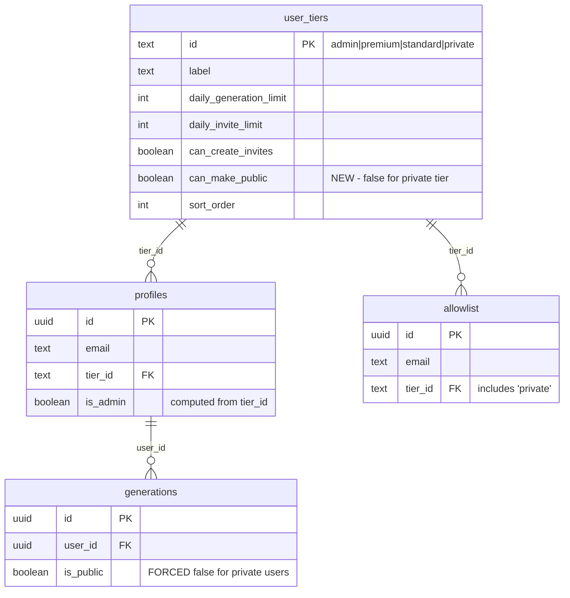

# feat: Add Private User Type for Invite-Only Privacy

## Overview

Add a new "Private" user tier that allows admins to invite users whose generated avatars are **always private** and never appear in public showcases. Private users have the same limits as Standard users (20 generations/day, no invites) but cannot toggle their avatars to public and don't see the public/private option in the UI.

## Problem Statement / Motivation

Some invited users may want or need their generated avatars to remain private (e.g., corporate users, privacy-conscious individuals). Currently, the only privacy control is a manual toggle that defaults to public. There's no way to:

1. Guarantee a user's avatars never appear publicly
2. Invite users with different privacy defaults
3. Remove the mental burden of privacy decisions from certain users

## Proposed Solution

1. Add a `private` tier to `user_tiers` table (same limits as `standard`)
2. Update invite flow to allow selecting "Private" tier
3. Force `is_public=false` server-side for all Private user generations
4. Hide privacy toggle in UI for Private users
5. Fix wallpaper/banner generation to respect privacy (currently hardcoded to public)

## Technical Approach

### Architecture



### Implementation Phases

#### Phase 1: Database Migration (CRITICAL)

**Tasks:**
- [ ] Add `private` tier to `user_tiers` table
- [ ] Add `can_make_public` boolean column to `user_tiers` (false for private, true for others)
- [ ] Deploy migration

**File: `supabase/migrations/YYYYMMDD_add_private_tier.sql`**

```sql
-- Add can_make_public column to user_tiers
ALTER TABLE public.user_tiers
ADD COLUMN can_make_public BOOLEAN DEFAULT true;

-- Set existing tiers
UPDATE public.user_tiers SET can_make_public = true WHERE id IN ('admin', 'premium', 'standard');

-- Insert private tier
INSERT INTO public.user_tiers (id, label, daily_generation_limit, daily_invite_limit, can_create_invites, can_make_public, sort_order)
VALUES ('private', 'Private', 20, 0, false, false, 4);

-- Create helper function to check if user can make public avatars
CREATE OR REPLACE FUNCTION public.can_make_public(user_id UUID)
RETURNS BOOLEAN
LANGUAGE SQL STABLE SECURITY DEFINER
AS $$
  SELECT COALESCE(
    (SELECT ut.can_make_public
     FROM public.profiles p
     JOIN public.user_tiers ut ON ut.id = p.tier_id
     WHERE p.id = user_id),
    true  -- Default to true for unknown users (shouldn't happen)
  );
$$;
```

#### Phase 2: Backend - Invite Flow

**Tasks:**
- [ ] Update `invite-user` edge function to accept 'private' tier
- [ ] Deploy edge function

**File: `supabase/functions/invite-user/index.ts` (lines 73-80)**

```typescript
// BEFORE
const validTiers = ['premium', 'standard']

// AFTER
const validTiers = ['premium', 'standard', 'private']
```

#### Phase 3: Backend - Privacy Enforcement (CRITICAL SECURITY)

**Tasks:**
- [ ] Update `generate-avatar` to force `is_public=false` for Private users
- [ ] Update `extend-image` to force `is_public=false` for Private users (fixes hardcoded bug)
- [ ] Deploy edge functions

**File: `supabase/functions/generate-avatar/index.ts` (around line 1300)**

```typescript
// After validating user, before storing generation:
const { data: canMakePublic } = await supabaseAdmin.rpc('can_make_public', { user_id: user.id })

// Force privacy for private users, regardless of what frontend sends
const finalIsPublic = canMakePublic ? isPublic : false
```

**File: `supabase/functions/extend-image/index.ts` (line 503)**

```typescript
// BEFORE (hardcoded to true)
is_public: true

// AFTER
const { data: canMakePublic } = await supabaseAdmin.rpc('can_make_public', { user_id: user.id })
is_public: canMakePublic ? (isPublic ?? true) : false
```

#### Phase 4: Frontend - Admin Invite UI

**Tasks:**
- [ ] Add 'private' tier to `InviteUser.tsx` tier selector
- [ ] Add Lock icon and appropriate styling

**File: `src/components/admin/InviteUser.tsx` (lines 7-12)**

```typescript
// Update tierConfig
const tierConfig = {
  premium: { label: 'Premium', icon: <Star className="h-4 w-4" />, color: 'purple' },
  standard: { label: 'Standard', icon: <User className="h-4 w-4" />, color: 'gray' },
  private: { label: 'Private', icon: <Lock className="h-4 w-4" />, color: 'orange' },
} as const

type TierOption = keyof typeof tierConfig  // Now includes 'private'
```

#### Phase 5: Frontend - Hide Privacy Toggle

**Tasks:**
- [ ] Create `useUserTier()` hook or extend existing hooks
- [ ] Hide privacy toggle in `GenerateStep.tsx` for Private users
- [ ] Add privacy toggle to wallpaper page (hidden for Private users)

**File: `src/hooks/useUserTier.ts` (NEW)**

```typescript
import { useEffect, useState } from 'react'
import { useAuth } from './useAuth'
import { supabase } from '@/lib/supabase'

export function useUserTier() {
  const { user, loading: authLoading } = useAuth()
  const [tierInfo, setTierInfo] = useState<{
    id: string
    canMakePublic: boolean
  } | null>(null)
  const [loading, setLoading] = useState(true)

  useEffect(() => {
    if (authLoading) return
    if (!user) {
      setTierInfo(null)
      setLoading(false)
      return
    }

    async function fetchTier() {
      const { data } = await supabase
        .from('profiles')
        .select('tier_id, user_tiers(can_make_public)')
        .eq('id', user.id)
        .single()

      setTierInfo({
        id: data?.tier_id ?? 'standard',
        canMakePublic: data?.user_tiers?.can_make_public ?? true,
      })
      setLoading(false)
    }

    fetchTier()
  }, [user, authLoading])

  return {
    tierInfo,
    loading: authLoading || loading,
    isPrivateTier: tierInfo?.id === 'private',
    canMakePublic: tierInfo?.canMakePublic ?? true,
  }
}
```

**File: `src/components/wizard/steps/GenerateStep.tsx` (lines 419-442, 572-595)**

```typescript
// At top of component
const { canMakePublic } = useUserTier()

// Wrap privacy toggle (line 419-442 - custom category)
{canMakePublic && (
  <label className="flex items-center gap-3 cursor-pointer">
    <input
      type="checkbox"
      checked={!state.isPublic}
      onChange={(e) => updateState({ isPublic: !e.target.checked })}
      className="..."
    />
    <span className="...">Keep my avatar private</span>
  </label>
)}

// Same pattern for lines 572-595 (predefined styles)
```

#### Phase 6: TypeScript Types

**Tasks:**
- [ ] Add 'private' to UserTier type
- [ ] Add canMakePublic to UserTierInfo type

**File: `src/types/index.ts` (line 208)**

```typescript
// BEFORE
export type UserTier = 'admin' | 'premium' | 'standard'

// AFTER
export type UserTier = 'admin' | 'premium' | 'standard' | 'private'

// Add to UserTierInfo interface
export interface UserTierInfo {
  id: UserTier
  label: string
  daily_generation_limit: number
  daily_invite_limit: number
  can_create_invites: boolean
  can_make_public: boolean  // NEW
  sort_order: number
}
```

## Acceptance Criteria

### Functional Requirements

- [ ] Admin can select "Private" tier when inviting users via InviteUser component
- [ ] Private users have same generation limits as Standard users (20/day)
- [ ] Private users cannot create invites (same as Standard)
- [ ] Private users do NOT see privacy toggle on wizard GenerateStep (custom category)
- [ ] Private users do NOT see privacy toggle on wizard GenerateStep (predefined styles)
- [ ] Private users do NOT see privacy toggle on wallpaper/banner pages
- [ ] All Private user generations are stored with `is_public=false` in database
- [ ] Private user avatars NEVER appear in homepage public showcase
- [ ] Private user wallpapers/banners NEVER appear in homepage public showcase
- [ ] Standard/Premium/Admin users continue to see and use privacy toggle normally

### Non-Functional Requirements

- [ ] No performance regression in generation flow (single RPC call to check tier)
- [ ] Database migration is backwards-compatible (existing users unaffected)
- [ ] Edge functions continue to work for existing tier types

### Quality Gates

- [ ] All existing tests pass
- [ ] Manual test: Create private user, verify no privacy toggle visible
- [ ] Manual test: Generate avatar as private user, verify `is_public=false` in database
- [ ] Manual test: Create wallpaper as private user, verify `is_public=false` in database
- [ ] Manual test: Verify private user avatars don't appear on homepage
- [ ] Security test: Attempt to set `is_public=true` via API as private user, verify it's forced to `false`

## Dependencies & Prerequisites

- Supabase CLI for migrations
- Access to deploy edge functions
- No external dependencies

## Risk Analysis & Mitigation

| Risk | Likelihood | Impact | Mitigation |
|------|------------|--------|------------|
| Wallpaper privacy leak before fix deployed | Medium | High | Deploy Phase 3 immediately after Phase 1 |
| Existing Standard users accidentally switched to Private | Low | Medium | Add confirmation dialog for tier changes |
| Cache staleness shows toggle briefly | Low | Low | Server-side enforcement prevents actual leak |
| RPC performance impact | Low | Low | `can_make_public()` is simple indexed query |

## Future Considerations

### Tier Change Behavior (Deferred)

**Question**: What happens to existing public avatars when user is changed to Private tier?

**Recommendation**: Leave existing avatars as-is (created under old tier rules). Only affect future generations. Document this behavior.

If retroactive privacy is needed later, add a migration helper:

```sql
-- OPTIONAL: Retroactively make all Private user avatars private
UPDATE public.generations g
SET is_public = false
FROM public.profiles p
WHERE g.user_id = p.id
AND p.tier_id = 'private'
AND g.is_public = true;
```

### Admin Tier Change UI (Deferred)

Currently admins change tiers via SQL. A future enhancement could add a dropdown to UserStats component.

### Privacy Badge in Gallery (Deferred)

Private users could see a 🔒 badge on their avatar thumbnails to confirm privacy. Not required for MVP.

## References & Research

### Internal References

- User tier system: [supabase/migrations/20251204133224_add_user_tiers.sql](supabase/migrations/20251204133224_add_user_tiers.sql)
- Allowlist with tiers: [supabase/migrations/20251204210033_add_tier_to_allowlist.sql](supabase/migrations/20251204210033_add_tier_to_allowlist.sql)
- Invite edge function: [supabase/functions/invite-user/index.ts:73-80](supabase/functions/invite-user/index.ts)
- Generate avatar: [supabase/functions/generate-avatar/index.ts:1300](supabase/functions/generate-avatar/index.ts)
- Extend image (wallpaper): [supabase/functions/extend-image/index.ts:503](supabase/functions/extend-image/index.ts)
- Privacy toggle (custom): [src/components/wizard/steps/GenerateStep.tsx:419-442](src/components/wizard/steps/GenerateStep.tsx)
- Privacy toggle (predefined): [src/components/wizard/steps/GenerateStep.tsx:572-595](src/components/wizard/steps/GenerateStep.tsx)
- InviteUser tier selector: [src/components/admin/InviteUser.tsx:107-124](src/components/admin/InviteUser.tsx)
- UserTier type: [src/types/index.ts:208](src/types/index.ts)

### External References

- Supabase RLS with user types: https://supabase.com/docs/guides/auth/row-level-security
- SECURITY DEFINER functions: https://supabase.com/docs/guides/database/functions
