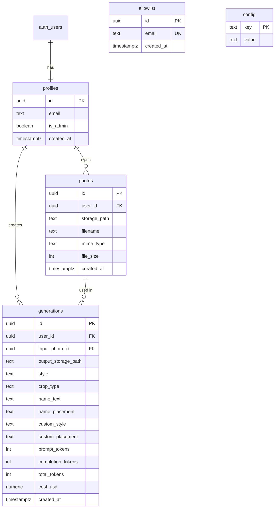

# Supabase Storage & Database Enhancements

## Overview

Add persistent storage, photo library, avatar gallery, generation tracking with rate limiting, cost tracking, and admin features to the avatar generation app.

## Problem Statement

Currently, the app handles images as base64 data URLs in memory only:
- Users lose their photos and generated avatars when they leave
- No way to browse previously generated avatars
- No generation limits or cost tracking
- Admin has limited visibility into system usage

## Proposed Solution

Implement Supabase Storage and database enhancements to provide:
1. Persistent photo library for input images
2. Gallery of generated avatars with metadata
3. Daily generation limits (20/day per user)
4. Cost tracking from Gemini API (admin-only visibility)
5. Admin dashboard for invites, generation history, and user stats

---

## Technical Approach

### Database Schema

#### New Tables

```sql
-- Photos table: stores user's input photo library
CREATE TABLE photos (
  id UUID PRIMARY KEY DEFAULT uuid_generate_v4(),
  user_id UUID NOT NULL REFERENCES auth.users(id) ON DELETE CASCADE,
  storage_path TEXT NOT NULL,
  filename TEXT NOT NULL,
  mime_type TEXT NOT NULL,
  file_size INTEGER NOT NULL,
  created_at TIMESTAMPTZ DEFAULT NOW()
);

CREATE INDEX idx_photos_user_created ON photos(user_id, created_at DESC);

-- Generations table: tracks all avatar generations
CREATE TABLE generations (
  id UUID PRIMARY KEY DEFAULT uuid_generate_v4(),
  user_id UUID NOT NULL REFERENCES auth.users(id) ON DELETE CASCADE,
  input_photo_id UUID REFERENCES photos(id) ON DELETE SET NULL,
  output_storage_path TEXT NOT NULL,
  style TEXT NOT NULL,
  crop_type TEXT NOT NULL,
  name_text TEXT,
  name_placement TEXT,
  custom_style TEXT,
  custom_placement TEXT,
  prompt_tokens INTEGER,
  completion_tokens INTEGER,
  total_tokens INTEGER,
  cost_usd NUMERIC(10, 6),
  created_at TIMESTAMPTZ DEFAULT NOW()
);

CREATE INDEX idx_generations_user_created ON generations(user_id, created_at DESC);
CREATE INDEX idx_generations_user_today ON generations(user_id, created_at)
  WHERE created_at >= CURRENT_DATE;
```

#### Schema Changes to Existing Tables

```sql
-- Profiles table already has is_admin, ensure ajchesney@gmail.com is admin
-- This is already handled by existing trigger checking config table
```

#### RLS Policies

```sql
-- Photos RLS
ALTER TABLE photos ENABLE ROW LEVEL SECURITY;

CREATE POLICY "Users can view own photos"
ON photos FOR SELECT TO authenticated
USING (auth.uid() = user_id);

CREATE POLICY "Users can insert own photos"
ON photos FOR INSERT TO authenticated
WITH CHECK (auth.uid() = user_id);

CREATE POLICY "Users can delete own photos"
ON photos FOR DELETE TO authenticated
USING (auth.uid() = user_id);

CREATE POLICY "Admins can view all photos"
ON photos FOR SELECT TO authenticated
USING (
  EXISTS (SELECT 1 FROM profiles WHERE id = auth.uid() AND is_admin = true)
);

-- Generations RLS
ALTER TABLE generations ENABLE ROW LEVEL SECURITY;

CREATE POLICY "Users can view own generations"
ON generations FOR SELECT TO authenticated
USING (auth.uid() = user_id);

CREATE POLICY "Users can insert own generations"
ON generations FOR INSERT TO authenticated
WITH CHECK (auth.uid() = user_id);

CREATE POLICY "Admins can view all generations"
ON generations FOR SELECT TO authenticated
USING (
  EXISTS (SELECT 1 FROM profiles WHERE id = auth.uid() AND is_admin = true)
);
```

#### Database Functions

```sql
-- Get user's generation count for today (UTC)
CREATE OR REPLACE FUNCTION get_daily_generation_count(p_user_id UUID)
RETURNS INTEGER
LANGUAGE SQL
STABLE
SECURITY DEFINER
AS $$
  SELECT COUNT(*)::INTEGER
  FROM generations
  WHERE user_id = p_user_id
    AND created_at >= CURRENT_DATE
    AND created_at < CURRENT_DATE + INTERVAL '1 day';
$$;

-- Get user quota info
CREATE OR REPLACE FUNCTION get_user_quota()
RETURNS JSON
LANGUAGE plpgsql
STABLE
SECURITY DEFINER
AS $$
DECLARE
  current_user_id UUID := auth.uid();
  usage_count INTEGER;
  daily_limit INTEGER := 20;
  is_user_admin BOOLEAN;
BEGIN
  -- Check if admin (unlimited)
  SELECT is_admin INTO is_user_admin
  FROM profiles WHERE id = current_user_id;

  IF is_user_admin THEN
    RETURN json_build_object(
      'limit', -1,
      'used', 0,
      'remaining', -1,
      'is_admin', true
    );
  END IF;

  -- Count today's generations
  SELECT get_daily_generation_count(current_user_id) INTO usage_count;

  RETURN json_build_object(
    'limit', daily_limit,
    'used', usage_count,
    'remaining', GREATEST(0, daily_limit - usage_count),
    'is_admin', false
  );
END;
$$;

-- Admin: Get user stats
CREATE OR REPLACE FUNCTION admin_get_user_stats()
RETURNS TABLE (
  user_id UUID,
  email TEXT,
  is_admin BOOLEAN,
  total_generations BIGINT,
  total_cost NUMERIC,
  generations_today BIGINT,
  last_generation_at TIMESTAMPTZ,
  created_at TIMESTAMPTZ
)
LANGUAGE plpgsql
STABLE
SECURITY DEFINER
AS $$
BEGIN
  -- Verify caller is admin
  IF NOT EXISTS (SELECT 1 FROM profiles WHERE id = auth.uid() AND is_admin = true) THEN
    RAISE EXCEPTION 'Unauthorized';
  END IF;

  RETURN QUERY
  SELECT
    p.id as user_id,
    p.email,
    p.is_admin,
    COUNT(g.id) as total_generations,
    COALESCE(SUM(g.cost_usd), 0) as total_cost,
    COUNT(g.id) FILTER (WHERE g.created_at >= CURRENT_DATE) as generations_today,
    MAX(g.created_at) as last_generation_at,
    p.created_at
  FROM profiles p
  LEFT JOIN generations g ON g.user_id = p.id
  GROUP BY p.id, p.email, p.is_admin, p.created_at
  ORDER BY total_generations DESC;
END;
$$;
```

### Storage Architecture

#### Buckets

| Bucket Name | Access | Purpose |
|-------------|--------|---------|
| `input-photos` | Private | User-uploaded photos for avatar generation |
| `avatars` | Private | Generated avatar images |

#### Folder Structure

```
input-photos/
└── {user_id}/
    ├── {timestamp}_{uuid}.jpg
    └── {timestamp}_{uuid}.png

avatars/
└── {user_id}/
    ├── {timestamp}_{uuid}.png
    └── {timestamp}_{uuid}.png
```

#### Storage RLS Policies

```sql
-- Input photos bucket policies
CREATE POLICY "Users can upload to own folder"
ON storage.objects FOR INSERT TO authenticated
WITH CHECK (
  bucket_id = 'input-photos'
  AND (storage.foldername(name))[1] = auth.uid()::text
);

CREATE POLICY "Users can view own photos"
ON storage.objects FOR SELECT TO authenticated
USING (
  bucket_id = 'input-photos'
  AND (storage.foldername(name))[1] = auth.uid()::text
);

CREATE POLICY "Users can delete own photos"
ON storage.objects FOR DELETE TO authenticated
USING (
  bucket_id = 'input-photos'
  AND (storage.foldername(name))[1] = auth.uid()::text
);

-- Avatars bucket policies (same pattern)
CREATE POLICY "Users can view own avatars"
ON storage.objects FOR SELECT TO authenticated
USING (
  bucket_id = 'avatars'
  AND (storage.foldername(name))[1] = auth.uid()::text
);

-- Edge function uses service role to write avatars
```

### Edge Function Changes

#### Updated generate-avatar/index.ts

Key modifications:
1. Check daily generation limit before processing
2. Upload generated avatar to Supabase storage
3. Extract token usage from Gemini API response
4. Calculate cost from token counts
5. Create generations table entry
6. Return storage path and generation ID

```typescript
// Pseudocode for edge function changes

// 1. Verify auth and get user
const user = await verifyAuth(req);

// 2. Check generation limit
const { data: quota } = await supabase.rpc('get_user_quota');
if (quota.remaining <= 0 && !quota.is_admin) {
  return error(429, 'Daily generation limit reached');
}

// 3. Get input photo from request (storage path or base64)
const inputPhotoPath = body.inputPhotoPath;

// 4. Generate avatar via Gemini API
const geminiResponse = await generateAvatar(prompt, imageData);

// 5. Extract usage metadata
const usage = geminiResponse.usageMetadata;
const cost = calculateCost(usage.promptTokenCount, usage.candidatesTokenCount);

// 6. Upload avatar to storage
const avatarPath = `${user.id}/${Date.now()}_${uuid()}.png`;
await supabaseAdmin.storage
  .from('avatars')
  .upload(avatarPath, avatarBuffer);

// 7. Create generation record
await supabaseAdmin.from('generations').insert({
  user_id: user.id,
  input_photo_id: inputPhotoId,
  output_storage_path: avatarPath,
  style, crop_type, name_text, name_placement,
  custom_style, custom_placement,
  prompt_tokens: usage.promptTokenCount,
  completion_tokens: usage.candidatesTokenCount,
  total_tokens: usage.totalTokenCount,
  cost_usd: cost
});

// 8. Return result
return {
  success: true,
  avatarPath,
  generationId,
  remaining: quota.remaining - 1
};
```

#### Cost Calculation

Based on Gemini API pricing (2025) for **Gemini 3 Pro Image Preview**:
- Input: $2.00 per 1M tokens (≤200K context)
- Output: $12.00 per 1M tokens (≤200K context)
- Image generation output: ~1120-2000 tokens per 1K-2K image

Estimated cost per avatar generation: ~$0.02-0.05 per image

```typescript
function calculateCost(inputTokens: number, outputTokens: number): number {
  // Gemini 3 Pro Image Preview pricing
  const INPUT_RATE = 2.00 / 1_000_000;   // $2.00 per 1M tokens
  const OUTPUT_RATE = 12.00 / 1_000_000; // $12.00 per 1M tokens
  return (inputTokens * INPUT_RATE) + (outputTokens * OUTPUT_RATE);
}
```

---

## Implementation Phases

### Phase 1: Database & Storage Foundation

**Files to create/modify:**
- `supabase/migrations/20251203_storage_enhancements.sql`

**Tasks:**
- [ ] Create photos table with indexes and RLS
- [ ] Create generations table with indexes and RLS
- [ ] Create storage buckets (input-photos, avatars)
- [ ] Create storage RLS policies
- [ ] Create database functions (get_user_quota, admin_get_user_stats)
- [ ] Test RLS policies work correctly

### Phase 2: Photo Library Feature

**Files to create/modify:**
- `src/pages/PhotoLibraryPage.tsx` (new)
- `src/components/photos/PhotoGrid.tsx` (new)
- `src/components/photos/PhotoUploader.tsx` (new)
- `src/hooks/usePhotos.ts` (new)
- `src/components/wizard/steps/CaptureStep.tsx` (modify)
- `src/App.tsx` (add route)
- `src/pages/HomePage.tsx` (add nav item)

**Tasks:**
- [ ] Create usePhotos hook for CRUD operations
- [ ] Create PhotoLibraryPage with grid view
- [ ] Create PhotoGrid component with delete functionality
- [ ] Modify CaptureStep to allow selecting from library
- [ ] Add "My Photos" to navigation
- [ ] Add photo upload to storage on capture
- [ ] Handle empty state for new users

### Phase 3: Avatar Gallery Feature

**Files to create/modify:**
- `src/pages/GalleryPage.tsx` (new)
- `src/components/gallery/AvatarGrid.tsx` (new)
- `src/components/gallery/AvatarCard.tsx` (new)
- `src/components/gallery/AvatarModal.tsx` (new)
- `src/hooks/useGenerations.ts` (new)
- `src/App.tsx` (add route)
- `src/pages/HomePage.tsx` (add nav item)

**Tasks:**
- [ ] Create useGenerations hook for fetching user's avatars
- [ ] Create GalleryPage with avatar grid
- [ ] Create AvatarCard showing thumbnail + metadata
- [ ] Create AvatarModal for full-size view + download
- [ ] Add "Gallery" to navigation
- [ ] Display generation date and options used
- [ ] Add download functionality
- [ ] Handle empty state

### Phase 4: Generation Tracking & Rate Limiting

**Files to create/modify:**
- `supabase/functions/generate-avatar/index.ts` (modify)
- `src/components/wizard/steps/GenerateStep.tsx` (modify)
- `src/hooks/useQuota.ts` (new)
- `src/components/ui/QuotaDisplay.tsx` (new)

**Tasks:**
- [ ] Modify edge function to check daily limit
- [ ] Modify edge function to upload avatar to storage
- [ ] Modify edge function to create generation record
- [ ] Extract token usage from Gemini response
- [ ] Calculate and store cost
- [ ] Create useQuota hook
- [ ] Create QuotaDisplay component
- [ ] Show remaining generations in UI
- [ ] Handle limit reached gracefully
- [ ] Update wizard to use storage paths

### Phase 5: Admin Features

**Files to create/modify:**
- `src/pages/AdminPage.tsx` (modify)
- `src/components/admin/InviteUser.tsx` (new)
- `src/components/admin/RecentGenerations.tsx` (new)
- `src/components/admin/UserStats.tsx` (new)
- `src/hooks/useAdminStats.ts` (new)
- `supabase/functions/invite-user/index.ts` (new)

**Tasks:**
- [ ] Create admin navigation tabs
- [ ] Create InviteUser component with email input
- [ ] Create invite-user edge function using Supabase admin API
- [ ] Create RecentGenerations component showing all generations with costs
- [ ] Create UserStats component with aggregated stats per user
- [ ] Create useAdminStats hook
- [ ] Protect admin routes
- [ ] Add pagination to admin views

---

## Acceptance Criteria

### Photo Library
- [ ] Users can save photos from webcam/upload to their library
- [ ] Users can view all their saved photos in "My Photos" page
- [ ] Users can select a photo from library in the wizard
- [ ] Users can delete photos from their library
- [ ] Photos are stored in Supabase storage with RLS protection

### Avatar Gallery
- [ ] All generated avatars are saved to Supabase storage
- [ ] Users can view their generated avatars in "Gallery" page
- [ ] Gallery shows generation date and options used
- [ ] Users can view full-size and download avatars
- [ ] Gallery is paginated for performance

### Generation Limits
- [ ] Users limited to 20 generations per day (UTC)
- [ ] Remaining count displayed in UI
- [ ] Clear error when limit reached
- [ ] Admin users have unlimited generations
- [ ] Limit resets at midnight UTC

### Cost Tracking
- [ ] Token usage extracted from Gemini API response
- [ ] Cost calculated and stored in generations table
- [ ] Cost NOT visible to regular users
- [ ] Cost visible to admins in generation history

### Admin Features
- [ ] Admin can invite users by email
- [ ] Invited users receive magic link
- [ ] Admin can view all recent generations with costs
- [ ] Admin can view per-user stats (count, cost, last generation)
- [ ] ajchesney@gmail.com is admin by default

---

## ERD Diagram



---

## References

### Internal Files
- Current schema: [supabase/migrations/20251203104423_avatarz_schema.sql](supabase/migrations/20251203104423_avatarz_schema.sql)
- Edge function: [supabase/functions/generate-avatar/index.ts](supabase/functions/generate-avatar/index.ts)
- Auth hook: [src/hooks/useAuth.ts](src/hooks/useAuth.ts)
- Admin hook: [src/hooks/useAdmin.ts](src/hooks/useAdmin.ts)
- Wizard container: [src/components/wizard/WizardContainer.tsx](src/components/wizard/WizardContainer.tsx)

### External Documentation
- [Supabase Storage Access Control](https://supabase.com/docs/guides/storage/security/access-control)
- [Supabase RLS Best Practices](https://supabase.com/docs/guides/database/postgres/row-level-security)
- [Supabase Admin Invite User](https://supabase.com/docs/reference/javascript/auth-admin-inviteuserbyemail)
- [Gemini API Token Counting](https://ai.google.dev/gemini-api/docs/tokens)
- [Gemini API Pricing](https://ai.google.dev/gemini-api/docs/pricing)

### Model Information
- **Current Model**: `gemini-3-pro-image-preview` (image generation/editing)
- **Endpoint**: `https://generativelanguage.googleapis.com/v1beta/models/gemini-3-pro-image-preview:generateContent`

---

## Design Decisions

### Daily Limit Timezone
**Decision**: Use UTC for all limit calculations
**Rationale**: Consistent across all users, simple to implement, avoids timezone edge cases

### Photo Upload Location
**Decision**: Frontend uploads photos to storage, edge function receives storage path
**Rationale**: Separates concerns, photos saved even if generation fails, enables photo library feature

### Cost Visibility
**Decision**: Cost data stored in generations table but filtered out for non-admin queries via RLS
**Rationale**: Single source of truth, admin-only SELECT policy on cost column would require separate table

### Generation Limit Enforcement
**Decision**: Check in edge function before calling Gemini API
**Rationale**: Prevents wasted API calls, can return remaining count in response

### Input Photo Reference
**Decision**: Foreign key to photos table with ON DELETE SET NULL
**Rationale**: Maintains referential integrity, generations persist even if source photo deleted
