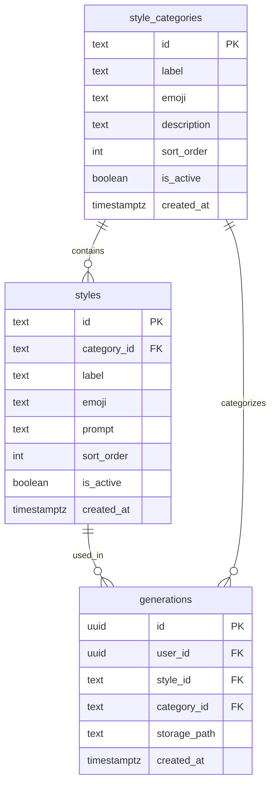

# Wizard Category Restructure - Style Categories Feature

## Overview

Restructure the avatar generation wizard to add a **category selection step** before style selection. **Move styles and categories from hard-coded Edge Function arrays into database tables**, enabling easy additions via migrations.

## Problem Statement

1. **UX Problem**: Users see all 14+ styles in a flat grid. As we add more styles, this becomes overwhelming.
2. **Maintainability Problem**: Styles are hard-coded in the Edge Function. Adding new prompts requires code changes and redeployment.

## Proposed Solution

1. **Add Category step** (Step 2) between Capture and Style
2. **Move styles to database** - `style_categories` and `styles` tables
3. **Add prompts via migrations** - Easy to add new styles without code changes

**Current Flow (6 steps):**
```
Capture → Style → Crop → Name → Generate → Download
```

**New Flow (7 steps):**
```
Capture → Category → Style → Crop → Name → Generate → Download
```

## Category Taxonomy

Based on Nano Banana Pro prompts and avatar generation best practices:

| Category | ID | Emoji | Description | Example Styles |
|----------|-----|-------|-------------|----------------|
| **Animated** | `animated` | 🎬 | Cartoons, anime, and 3D characters | ghibli, 3d-pixar, cartoon, anime |
| **Artistic** | `artistic` | 🎨 | Hand-drawn and painterly styles | watercolor, oil-painting, pop-art |
| **Professional** | `professional` | 💼 | Business and corporate looks | realistic, business-headshot |
| **Nostalgic** | `nostalgic` | 📷 | Retro and vintage aesthetics | vintage, 2000s-selfie, 90s-film |
| **Fantasy** | `fantasy` | ✨ | Magical and otherworldly | fantasy, cyberpunk |
| **Fun** | `fun` | 🎮 | Playful and unique | pixel-art, figurine, storybook |
| **Custom** | `custom` | ✏️ | Write your own prompt | (freeform text) |

## Technical Approach

### Phase 1: Database Schema Migration

Create new tables for categories and styles with full prompt data.

**File:** `supabase/migrations/YYYYMMDDHHMMSS_add_style_categories_and_styles.sql`

```sql
-- ============================================================================
-- STYLE CATEGORIES TABLE
-- ============================================================================

CREATE TABLE public.style_categories (
  id TEXT PRIMARY KEY,
  label TEXT NOT NULL,
  emoji TEXT NOT NULL,
  description TEXT NOT NULL,
  sort_order INTEGER NOT NULL DEFAULT 0,
  is_active BOOLEAN NOT NULL DEFAULT true,
  created_at TIMESTAMPTZ NOT NULL DEFAULT NOW()
);

-- No RLS - public read access for options endpoint
ALTER TABLE public.style_categories ENABLE ROW LEVEL SECURITY;

CREATE POLICY "Anyone can view active categories"
ON public.style_categories FOR SELECT
USING (is_active = true);

-- ============================================================================
-- STYLES TABLE
-- ============================================================================

CREATE TABLE public.styles (
  id TEXT PRIMARY KEY,
  category_id TEXT NOT NULL REFERENCES public.style_categories(id) ON DELETE CASCADE,
  label TEXT NOT NULL,
  emoji TEXT NOT NULL,
  prompt TEXT NOT NULL,
  sort_order INTEGER NOT NULL DEFAULT 0,
  is_active BOOLEAN NOT NULL DEFAULT true,
  created_at TIMESTAMPTZ NOT NULL DEFAULT NOW()
);

CREATE INDEX idx_styles_category ON public.styles(category_id);
CREATE INDEX idx_styles_active ON public.styles(is_active) WHERE is_active = true;

ALTER TABLE public.styles ENABLE ROW LEVEL SECURITY;

CREATE POLICY "Anyone can view active styles"
ON public.styles FOR SELECT
USING (is_active = true);

-- ============================================================================
-- SEED CATEGORIES
-- ============================================================================

INSERT INTO public.style_categories (id, label, emoji, description, sort_order) VALUES
  ('animated', 'Animated', '🎬', 'Cartoons, anime, and 3D characters', 1),
  ('artistic', 'Artistic', '🎨', 'Hand-drawn and painterly styles', 2),
  ('professional', 'Professional', '💼', 'Business and corporate looks', 3),
  ('nostalgic', 'Nostalgic', '📷', 'Retro and vintage aesthetics', 4),
  ('fantasy', 'Fantasy', '✨', 'Magical and otherworldly', 5),
  ('fun', 'Fun & Unique', '🎮', 'Playful and creative styles', 6),
  ('custom', 'Custom', '✏️', 'Write your own prompt', 99);

-- ============================================================================
-- SEED STYLES (existing 14 styles from Edge Function)
-- ============================================================================

-- Animated Category
INSERT INTO public.styles (id, category_id, label, emoji, prompt, sort_order) VALUES
  ('ghibli', 'animated', 'Studio Ghibli', '🌸',
   'Transform into a Studio Ghibli-inspired anime character. Style: hand-painted watercolor aesthetic with soft cel-shading. Keep the face recognizable but with large emotional anime eyes, wind-swept hair with individual strands visible. Soft natural lighting with a dreamy atmosphere.',
   1),
  ('3d-pixar', 'animated', '3D Animated', '🎬',
   'Transform into a cinematic 3D animated movie character like Pixar or DreamWorks style. High-quality CGI with oversized expressive eyes, smooth skin textures, soft volumetric lighting. Keep the face recognizable. Vibrant gradient background.',
   2),
  ('cartoon', 'animated', 'Cartoon', '🎨',
   'Transform into a vibrant cartoon character with bold outlines, exaggerated features, and bright flat colors. Keep the face recognizable but stylized with simplified shapes. Clean vector-art style with dynamic pose.',
   3),
  ('anime', 'animated', 'Anime', '⚔️',
   'Transform into a modern anime character with sharp features, dramatic shading, and vibrant colors. Large expressive eyes, detailed hair with highlights. Keep facial features recognizable. Dynamic anime lighting with rim lights.',
   4);

-- Artistic Category
INSERT INTO public.styles (id, category_id, label, emoji, prompt, sort_order) VALUES
  ('watercolor', 'artistic', 'Watercolor', '🖌️',
   'Transform into a beautiful watercolor painting with soft edges, visible brush strokes, and gentle color bleeds. Keep the face recognizable with delicate features. Artistic splashes and drips around the edges. Fine art portrait style.',
   1),
  ('oil-painting', 'artistic', 'Oil Painting', '🖼️',
   'Transform into a classical oil painting portrait in the style of Dutch masters. Rich colors, dramatic chiaroscuro lighting, visible brush strokes with impasto technique. Keep the face recognizable. Museum-quality fine art aesthetic.',
   2),
  ('pop-art', 'artistic', 'Pop Art', '💥',
   'Transform into bold pop art in the style of Andy Warhol and Roy Lichtenstein. Bright primary colors, halftone dot patterns, thick black outlines. Keep the face recognizable but highly stylized. Comic book aesthetic with Ben-Day dots.',
   3);

-- Professional Category
INSERT INTO public.styles (id, category_id, label, emoji, prompt, sort_order) VALUES
  ('realistic', 'professional', 'Enhanced Photo', '📸',
   'Enhance this photo with professional studio lighting, subtle skin retouching, and cinematic color grading. Keep the person looking natural but elevated - like a high-end magazine portrait. Soft bokeh background.',
   1);

-- Nostalgic Category
INSERT INTO public.styles (id, category_id, label, emoji, prompt, sort_order) VALUES
  ('vintage', 'nostalgic', 'Vintage Photo', '📻',
   'Transform into a vintage photograph from the 1950s-60s. Sepia or faded color tones, film grain, soft focus, and nostalgic lighting. Keep the face recognizable. Classic portrait photography aesthetic with period-appropriate styling.',
   1);

-- Fantasy Category
INSERT INTO public.styles (id, category_id, label, emoji, prompt, sort_order) VALUES
  ('fantasy', 'fantasy', 'Fantasy Hero', '🧙',
   'Transform into an epic fantasy character - a hero from a magical realm. Keep the face recognizable but add fantasy elements like ethereal lighting, magical aura, or subtle fantasy attire hints. Dramatic cinematic lighting with a mystical atmosphere.',
   1),
  ('cyberpunk', 'fantasy', 'Cyberpunk', '🤖',
   'Transform into a cyberpunk character with neon accents, holographic elements, and futuristic tech accessories. Dramatic teal and orange rim lighting. Keep the face recognizable but add subtle cyber enhancements. Rainy neon-lit city background.',
   2);

-- Fun Category
INSERT INTO public.styles (id, category_id, label, emoji, prompt, sort_order) VALUES
  ('pixel-art', 'fun', 'Pixel Art', '👾',
   'Transform into a detailed pixel art portrait in 32-bit retro game style. Visible pixels with careful dithering for shading. Keep facial features recognizable within the pixel constraints. Retro game aesthetic with limited color palette.',
   1),
  ('figurine', 'fun', 'Collectible Figure', '🎁',
   'Transform into a 3D collectible figurine with an oversized head, simplified but recognizable facial features, and a cute stylized look. Modern designer toy aesthetic. Show as if displayed on a shelf or in collectible box packaging.',
   2),
  ('storybook', 'fun', 'Children''s Book', '📚',
   'Transform into a cute illustrated character for a children''s book. Keep the face recognizable but soften all features into a friendly, approachable illustrated style. Hand-drawn aesthetic with soft colors, whimsical details like stars or clouds.',
   3);

-- ============================================================================
-- UPDATE GENERATIONS TABLE (optional: track category)
-- ============================================================================

ALTER TABLE public.generations
ADD COLUMN IF NOT EXISTS category_id TEXT REFERENCES public.style_categories(id);

-- Create index for analytics queries
CREATE INDEX IF NOT EXISTS idx_generations_category ON public.generations(category_id);
```

### Phase 2: Future Styles Migration (Example)

Show how easy it is to add new styles via migration:

**File:** `supabase/migrations/YYYYMMDDHHMMSS_add_nano_banana_prompts.sql`

```sql
-- Add new prompts inspired by Nano Banana Pro

-- Add 2000s Mirror Selfie to Nostalgic category
INSERT INTO public.styles (id, category_id, label, emoji, prompt, sort_order) VALUES
  ('2000s-selfie', 'nostalgic', '2000s Mirror Selfie', '📱',
   'Transform into an early-2000s digital camera aesthetic mirror selfie. Low resolution 2MP camera quality, harsh direct flash with bright blown-out highlights, slight purple/blue chromatic aberration, visible JPEG compression artifacts. Nostalgic bedroom background with posters. Keep face recognizable.',
   2);

-- Add Professional Headshot to Professional category
INSERT INTO public.styles (id, category_id, label, emoji, prompt, sort_order) VALUES
  ('business-headshot', 'professional', 'Business Headshot', '💼',
   'A professional high-resolution profile photo maintaining the exact facial structure and identity. The subject is framed from the chest up, wearing a premium smart casual blazer in charcoal gray. Shot on an 85mm f/1.8 lens with shallow depth of field. Solid neutral gray studio backdrop with subtle gradient. Soft diffused studio lighting creating subtle catchlight in the eyes. Clean bright cinematic color grading.',
   2);

-- Add Film Noir to Fantasy category
INSERT INTO public.styles (id, category_id, label, emoji, prompt, sort_order) VALUES
  ('film-noir', 'fantasy', 'Film Noir', '🎬',
   'A hyper-realistic cinematic portrait with harsh high-contrast black and white lighting. Subject on a wet rainy city street at 3 AM. Film Noir aesthetic with moody shadows, dramatic venetian blind light patterns. Heavy film grain. Shot on a 50mm lens with f/2.8 aperture. Low-angle perspective. 1940s detective movie atmosphere. Keep face recognizable.',
   3);
```

### Phase 3: Update Edge Function

Modify Edge Function to fetch styles from database instead of hard-coded arrays.

**File:** `supabase/functions/generate-avatar/index.ts`

**Key Changes:**

1. Remove hard-coded `STYLES` array (lines 35-120)
2. Fetch styles from database in GET handler
3. Fetch style prompt by ID in POST handler

```typescript
// GET handler - fetch options from database
if (req.method === 'GET') {
  // Fetch categories and styles from database
  const { data: categories, error: catError } = await supabase
    .from('style_categories')
    .select('id, label, emoji, description, sort_order')
    .eq('is_active', true)
    .order('sort_order')

  const { data: styles, error: styleError } = await supabase
    .from('styles')
    .select('id, category_id, label, emoji, sort_order')
    .eq('is_active', true)
    .order('sort_order')

  if (catError || styleError) {
    console.error('Failed to fetch options:', catError || styleError)
    return new Response(
      JSON.stringify({ error: 'Failed to load options' }),
      { status: 500, headers: corsHeaders }
    )
  }

  return new Response(
    JSON.stringify({
      categories,
      styles: styles.map(s => ({
        id: s.id,
        label: s.label,
        emoji: s.emoji,
        categoryId: s.category_id,
      })),
      namePlacements: NAME_PLACEMENTS.map(p => ({
        id: p.id,
        label: p.label,
        description: p.description,
      })),
      cropTypes: CROP_TYPES.map(c => ({
        id: c.id,
        label: c.label,
        description: c.description,
      })),
    }),
    { headers: corsHeaders }
  )
}

// POST handler - fetch style prompt from database
const { data: styleData, error: styleError } = await supabase
  .from('styles')
  .select('prompt, category_id')
  .eq('id', validatedReq.style)
  .eq('is_active', true)
  .single()

if (styleError || !styleData) {
  return new Response(
    JSON.stringify({ error: 'Invalid style' }),
    { status: 400, headers: corsHeaders }
  )
}

const stylePrompt = styleData.prompt

// Use stylePrompt instead of STYLE_MAP.get(...)
```

### Phase 4: Frontend Types

**File:** `src/types/index.ts`

```typescript
// Add CategoryOption interface
export interface CategoryOption {
  id: string
  label: string
  emoji: string
  description: string
}

// Update StyleOption to include categoryId
export interface StyleOption {
  id: string
  label: string
  emoji: string
  categoryId: string
}

// Update AvatarOptions to include categories
export interface AvatarOptions {
  categories: CategoryOption[]
  styles: StyleOption[]
  namePlacements: NamePlacementOption[]
  cropTypes: CropTypeOption[]
}

// Update WizardState to include category
export interface WizardState {
  imageData: string | null
  category: string | null  // NEW: selected category ID
  style: string
  customStyle: string
  cropType: string
  showName: boolean
  name: string
  namePlacement: string
  customPlacement: string
  generatedImage: string | null
  isPublic: boolean
}
```

### Phase 5: Wizard State Hook

**File:** `src/hooks/useWizard.ts`

```typescript
const createInitialState = (options?: AvatarOptions | null): WizardState => ({
  imageData: null,
  category: null,  // NEW: no category selected initially
  style: options?.styles[0]?.id || 'ghibli',
  customStyle: '',
  cropType: options?.cropTypes[0]?.id || 'headshot',
  showName: false,
  name: '',
  namePlacement: options?.namePlacements[0]?.id || 'graffiti',
  customPlacement: '',
  generatedImage: null,
  isPublic: true,
})

// Update max step from 5 to 6 (now 7 steps: 0-6)
const nextStep = () => setStep((s) => Math.min(s + 1, 6))

// Add category change handler
const updateState = (updates: Partial<WizardState>) => {
  setState((prev) => {
    const newState = { ...prev, ...updates }

    // When category changes, reset style to first in new category
    if (updates.category !== undefined && updates.category !== prev.category) {
      if (updates.category === 'custom') {
        newState.style = ''  // No preset style for custom
      } else {
        const firstStyle = options?.styles.find(s => s.categoryId === updates.category)
        newState.style = firstStyle?.id || ''
      }
      newState.customStyle = ''
    }

    return newState
  })
}
```

### Phase 6: CategoryStep Component

**File:** `src/components/wizard/steps/CategoryStep.tsx` (NEW)

```typescript
import { Button } from '@/components/ui/button'
import { WizardHook } from '@/hooks/useWizard'
import { AvatarOptions } from '@/types'
import { ArrowLeft, ArrowRight } from 'lucide-react'
import { motion } from 'framer-motion'

interface CategoryStepProps {
  wizard: WizardHook
  options: AvatarOptions | null
}

const containerVariants = {
  hidden: { opacity: 0 },
  show: { opacity: 1, transition: { staggerChildren: 0.08 } }
}

const itemVariants = {
  hidden: { opacity: 0, y: 20 },
  show: { opacity: 1, y: 0 }
}

export function CategoryStep({ wizard, options }: CategoryStepProps) {
  const { state, updateState, nextStep, prevStep } = wizard
  const categories = options?.categories || []

  return (
    <div className="space-y-6">
      <div className="text-center">
        <h2 className="text-2xl font-bold text-white mb-2">
          What kind of avatar do you want?
        </h2>
        <p className="text-gray-400 text-sm">
          Choose a category to see style options
        </p>
      </div>

      <motion.div
        variants={containerVariants}
        initial="hidden"
        animate="show"
        className="grid grid-cols-1 sm:grid-cols-2 gap-4"
      >
        {categories.map((category) => (
          <motion.button
            key={category.id}
            variants={itemVariants}
            onClick={() => updateState({ category: category.id })}
            whileHover={{ scale: 1.02 }}
            whileTap={{ scale: 0.98 }}
            className={`
              p-6 rounded-xl border-2 transition-all text-left
              ${state.category === category.id
                ? 'bg-gradient-to-br from-purple-500/30 to-pink-500/30 border-purple-400 ring-2 ring-purple-400/50'
                : 'bg-white/5 border-white/10 hover:border-white/30 hover:bg-white/10'
              }
            `}
          >
            <div className="text-4xl mb-3">{category.emoji}</div>
            <div className="text-white text-lg font-semibold mb-1">
              {category.label}
            </div>
            <div className="text-gray-400 text-sm">
              {category.description}
            </div>
          </motion.button>
        ))}
      </motion.div>

      <div className="flex justify-center gap-4 pt-4">
        <Button
          variant="outline"
          onClick={prevStep}
          className="border-white/20 text-white hover:bg-white/10"
        >
          <ArrowLeft className="mr-2 h-4 w-4" />
          Back
        </Button>
        <Button
          onClick={nextStep}
          disabled={!state.category}
          className="bg-gradient-to-r from-purple-500 to-pink-500 hover:from-purple-600 hover:to-pink-600 disabled:opacity-50"
        >
          Continue
          <ArrowRight className="ml-2 h-4 w-4" />
        </Button>
      </div>
    </div>
  )
}
```

### Phase 7: Update StyleStep

**File:** `src/components/wizard/steps/StyleStep.tsx`

Key changes:
1. Filter styles by selected category
2. Handle "custom" category (only show textarea)
3. Add "Change category" link

```typescript
export function StyleStep({ wizard, options }: StyleStepProps) {
  const { state, updateState, nextStep, prevStep } = wizard

  // Filter styles by selected category
  const availableStyles = options?.styles.filter(style =>
    style.categoryId === state.category
  ) || []

  // Custom category shows only textarea
  const isCustomCategory = state.category === 'custom'

  return (
    <div className="space-y-6">
      <div className="text-center">
        <h2 className="text-2xl font-bold text-white mb-2">
          {isCustomCategory ? 'Describe your style' : 'Choose your style'}
        </h2>
        <button
          onClick={prevStep}
          className="text-purple-400 text-sm hover:underline"
        >
          ← Change category
        </button>
      </div>

      {isCustomCategory ? (
        <div className="space-y-4">
          <textarea
            value={state.customStyle}
            onChange={(e) => updateState({ customStyle: e.target.value })}
            placeholder="Describe the avatar style you want... (e.g., 'cyberpunk detective in neon-lit rain')"
            maxLength={500}
            rows={6}
            className="w-full bg-white/5 border border-white/10 rounded-lg p-4
              text-white placeholder-gray-500 resize-none focus:border-purple-400
              focus:outline-none focus:ring-1 focus:ring-purple-400"
          />
          <div className="text-right text-sm text-gray-400">
            {state.customStyle.length}/500
          </div>
        </div>
      ) : (
        <motion.div className="grid grid-cols-2 sm:grid-cols-3 md:grid-cols-4 gap-3">
          {availableStyles.map((style) => (
            <motion.button
              key={style.id}
              onClick={() => updateState({ style: style.id })}
              className={`p-4 rounded-xl border-2 transition-all text-center
                ${state.style === style.id
                  ? 'bg-gradient-to-br from-purple-500/30 to-pink-500/30 border-purple-400'
                  : 'bg-white/5 border-white/10 hover:border-white/30'
                }`}
            >
              <div className="text-2xl mb-2">{style.emoji}</div>
              <div className="text-white text-sm font-medium">{style.label}</div>
            </motion.button>
          ))}
        </motion.div>
      )}

      <div className="flex justify-center gap-4 pt-4">
        <Button variant="outline" onClick={prevStep}>
          <ArrowLeft className="mr-2 h-4 w-4" />
          Back
        </Button>
        <Button
          onClick={nextStep}
          disabled={isCustomCategory ? !state.customStyle.trim() : !state.style}
        >
          Continue
          <ArrowRight className="ml-2 h-4 w-4" />
        </Button>
      </div>
    </div>
  )
}
```

### Phase 8: Update WizardContainer

**File:** `src/components/wizard/WizardContainer.tsx`

```typescript
const steps = ['Capture', 'Category', 'Style', 'Crop', 'Name', 'Generate', 'Download']

const renderStep = () => {
  switch (wizard.step) {
    case 0:
      return <CaptureStep wizard={wizard} />
    case 1:
      return <CategoryStep wizard={wizard} options={options} />  // NEW
    case 2:
      return <StyleStep wizard={wizard} options={options} />
    case 3:
      return <CropStep wizard={wizard} options={options} />
    case 4:
      return <NameStep wizard={wizard} options={options} />
    case 5:
      return <GenerateStep wizard={wizard} />
    case 6:
      return <DownloadStep wizard={wizard} />
    default:
      return null
  }
}
```

### Phase 9: Update useAvatarOptions

**File:** `src/hooks/useAvatarOptions.ts`

Add fallback categories for offline mode:

```typescript
const FALLBACK_OPTIONS: AvatarOptions = {
  categories: [
    { id: 'animated', label: 'Animated', emoji: '🎬', description: 'Cartoons and 3D' },
    { id: 'artistic', label: 'Artistic', emoji: '🎨', description: 'Painterly styles' },
    { id: 'custom', label: 'Custom', emoji: '✏️', description: 'Write your own' },
  ],
  styles: [
    { id: 'ghibli', label: 'Studio Ghibli', emoji: '🌸', categoryId: 'animated' },
    { id: '3d-pixar', label: '3D Animated', emoji: '🎬', categoryId: 'animated' },
    { id: 'watercolor', label: 'Watercolor', emoji: '🖌️', categoryId: 'artistic' },
  ],
  namePlacements: [...],
  cropTypes: [...],
}
```

## Acceptance Criteria

### Functional Requirements
- [ ] Category step displays after Capture, before Style
- [ ] Categories and styles load from database (not hard-coded)
- [ ] Selecting a category filters the Style step
- [ ] "Custom" category shows only freeform text input
- [ ] Changing category resets style selection
- [ ] Step indicator shows 7 steps
- [ ] New styles can be added via SQL migrations

### Non-Functional Requirements
- [ ] Categories/styles cached appropriately
- [ ] Fallback works when database unavailable
- [ ] Mobile-responsive grid
- [ ] Keyboard navigable

### Quality Gates
- [ ] Build passes with no TypeScript errors
- [ ] Migration applies cleanly
- [ ] Manual testing of wizard flows
- [ ] Tested adding new style via migration

## Files to Create/Modify

| File | Action | Changes |
|------|--------|---------|
| `supabase/migrations/*_add_style_categories.sql` | **NEW** | Create tables, seed data |
| `supabase/functions/generate-avatar/index.ts` | Modify | Fetch from DB, remove hard-coded arrays |
| `src/types/index.ts` | Modify | Add CategoryOption, update types |
| `src/hooks/useWizard.ts` | Modify | Add category state, update step count |
| `src/hooks/useAvatarOptions.ts` | Modify | Parse categories, update fallback |
| `src/components/wizard/WizardContainer.tsx` | Modify | Update steps, add CategoryStep |
| `src/components/wizard/steps/CategoryStep.tsx` | **NEW** | Category selection UI |
| `src/components/wizard/steps/StyleStep.tsx` | Modify | Filter by category |

## ERD Diagram



## Migration Workflow for New Prompts

To add new prompts in the future:

```bash
# 1. Create new migration file
supabase migration new add_magazine_cover_style

# 2. Edit the migration SQL
# supabase/migrations/YYYYMMDDHHMMSS_add_magazine_cover_style.sql

# 3. Apply locally
supabase db push

# 4. Deploy to production
supabase db push --linked
```

Example migration content:
```sql
INSERT INTO public.styles (id, category_id, label, emoji, prompt, sort_order) VALUES
  ('magazine-cover', 'professional', 'Magazine Cover', '📰',
   'A photo of a glossy magazine cover featuring the person. Large bold masthead text at top. Dynamic portrait pose in high-end fashion. Issue number and date in corner with barcode. Professional editorial photography lighting.',
   3);
```

## Future Considerations

- **Style preview images**: Store example outputs per style in storage bucket
- **Category icons**: Replace emojis with custom SVG icons
- **Admin UI**: Add admin page to manage categories/styles without SQL
- **Style popularity**: Track usage for "Popular" sorting
- **A/B testing**: Test different category orderings

## References

### Internal References
- [WizardContainer.tsx:13](src/components/wizard/WizardContainer.tsx#L13) - Current step names
- [useWizard.ts:4-15](src/hooks/useWizard.ts#L4-L15) - Wizard state structure
- [generate-avatar/index.ts:35-120](supabase/functions/generate-avatar/index.ts#L35-L120) - Current hard-coded styles

### External References
- [Nano Banana Pro Prompts](https://github.com/ZeroLu/awesome-nanobanana-pro) - Style inspiration
- [Gemini Prompting Guide](https://developers.googleblog.com/en/how-to-prompt-gemini-2-5-flash-image-generation-for-the-best-results/) - Prompt best practices
- [Supabase Migrations](https://supabase.com/docs/guides/database/migrations) - Migration workflow
